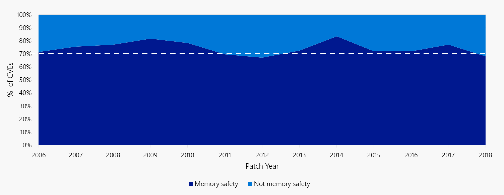
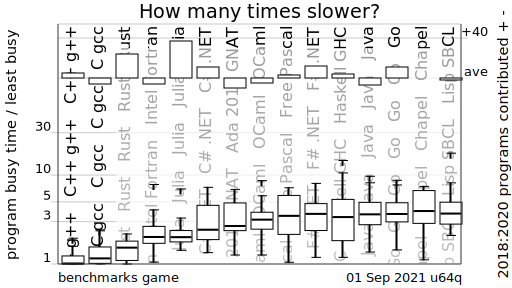
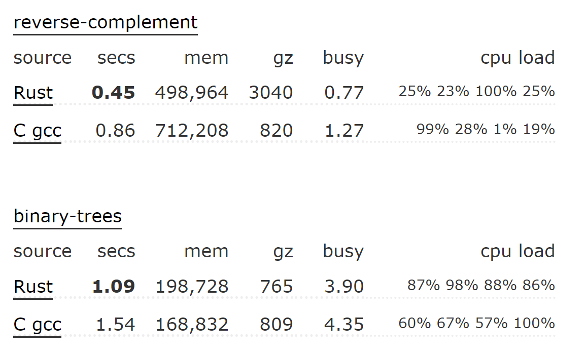
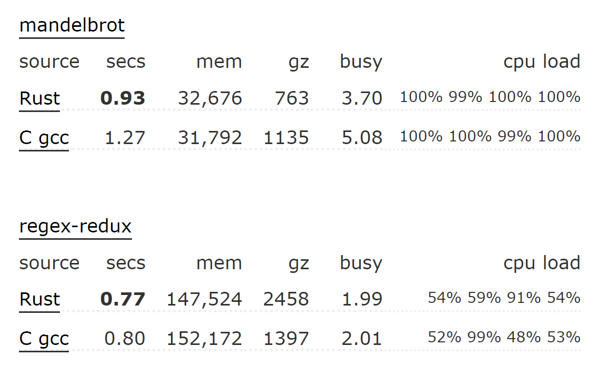
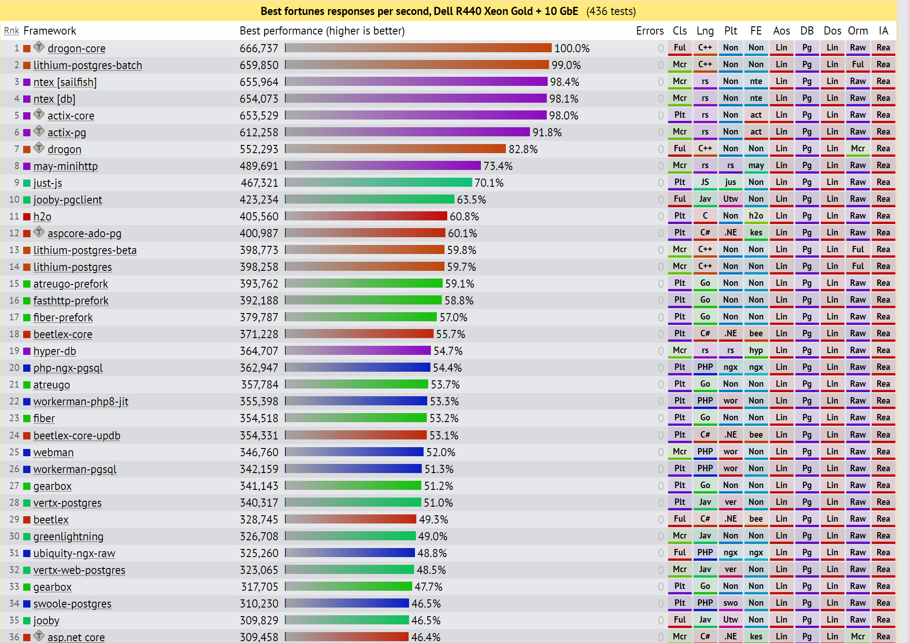
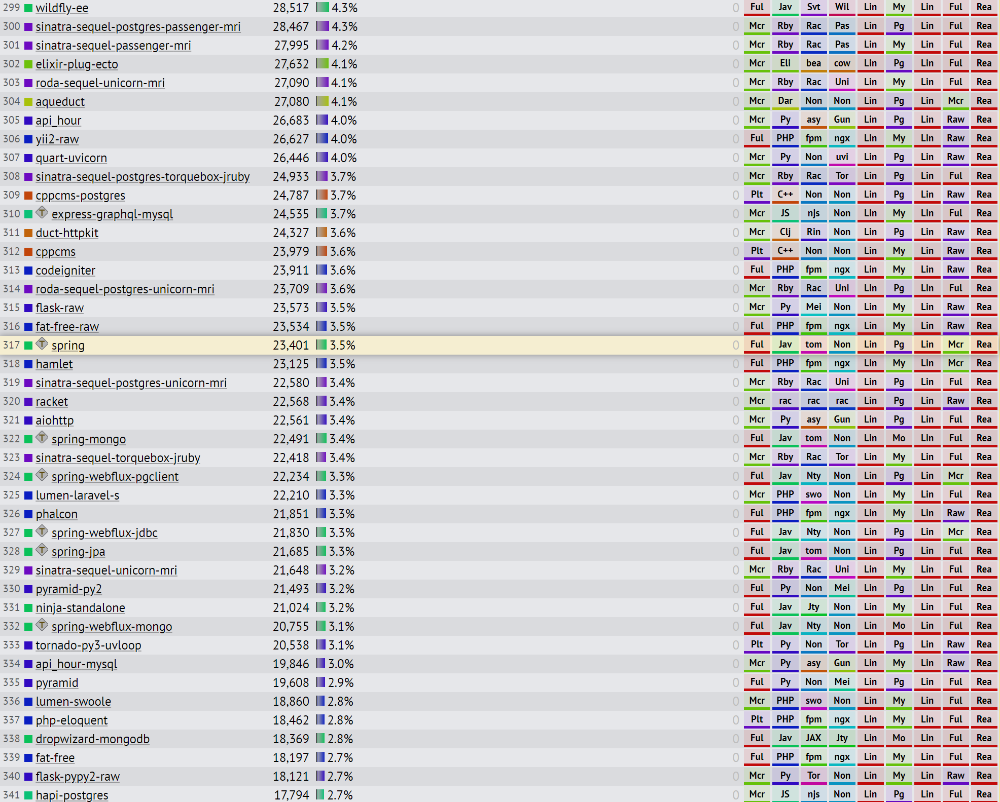

# <!--fit--> PV281: Programování v Rustu

---
# <!--fit--> ORGANIZAČNÍ INFORMACE

---

# <!--fit--> PŘENÁŠKY
**2h** týdně

Přednášející: **Grolig, Pitner**

Během přenášky projdeme teorii a základní příklady.

---


Jsou nahávané a dostupné na:
https://www.dropbox.com/sh/cvlth71b81x4raf/AABmXNUWMq-QSjNz4sbDOs2Ea?dl=0

---


Budou streamované v **úterý večer (20:00)**.
https://www.twitch.tv/vexfalard

---
# <!--fit--> CVIČENÍ
**2h** týdně, 12 cvičení

Cvičící: **Pitoňáková**

Na cvičení si zopakujete probranou látku a budete vypracovávat příklady s pomocí cvičí.

---


Organizační informace, diskuze k Rustu, pomoc s projekty, hledání parťáka

https://discord.gg/ZMvRqSqTfZ

---
# HODNOCENÍ

Maximum bodů: **100**
Minimum pro úspěšné zakončení předmětu: **75**

---
# HODNOCENÍ: Cvičení

* 10 bodů aktivita na cvičení
* \+ bonusové body
* neřešíme absenci, ale v případě absence není možné získat body

---
# HODNOCENÍ: Úkoly
* 26 bodů domácí úkoly
* 12 bodů za code review

---
# HODNOCENÍ: Úkoly
### První 4 úkoly za 2 body
* Úkoly obsahují automatizované testy. Procházející testy = 2b.
* Hodnocení kódu od opravujících (Katka & Dan) = 2b po zapracování připomínek

---
# HODNOCENÍ: Úkoly
### Zbývajících 6 úkolů za 3 body, ke každému code review za 2 body
* Úkoly opět obsahují automatizované testy. Procházející testy = 2b.
* Na cvičení si najdete reviewera z řad spolužáků (ze stejného cvičení)
* Reviewer projde Váš kód a zpracuje code review (CR) v pull requestu.

---
# HODNOCENÍ: Úkoly
### Zbývajících 6 úkolů za 3 body, ke každému code review za 2 body
* Zapracujete změny (0,5b)
* Reviewer zkontroluje změny a pokud to bude nutné, tak dá druhé kolo připomínek.
* Zapracujete změny pokud budou nutné (0,5b)
* Opravující zhodnotí kvalitu provedeného CR a reviewer může dostat 2 body

---
# <!--fit-->HODNOCENÍ: Code Review
### Každé code review je za 2 body
* Opravující hodnotí kvalitu code review z pohledu:
  + odhalených neodstatků
  + úroveň komunikace
  + kvalita vysvětlení

---
# HODNOCENÍ: Projekt
* **52 bodů** za týmový projekt zakončený obhajobou
* **3-4 členné týmy** - nikdy ne více. V případě menšího týmu nedojde ke snížení náročnosti.
* Týmy lze tvořit mezi skupinami
* Zadání zveřejníme v **5. týdnu** semestru

---
# BONUSOVÉ BODY
* Možné získat na cvičeních za aktivity
* Při zpracování úkolů/projektu za špičkové zpracování a výrazné překročení rozsahu
* Na přednášce za aktivitu
* Seznámení ostatních na přednášce s vlastním zajímavým projektem

---
# PROBÍRANÁ LÁTKA
* Intro - trocha historie, hlavní výhody a nevýhody
* Syntaxe jazyka
* CLI aplikace
* Asynchronní programování
* Paralelní programování
* Práce se soubory
* Obsluha chybových stavů

---
# PROBÍRANÁ LÁTKA
* Práce s databází
* Webové frameworky
* GRPC protokol
* Spoluáce s jinými jazyky (C, Python, Javascript)
* Desktopové aplikace
* Webassembly

---
# PROBÍRANÁ LÁTKA MIMO RUST
* Budeme hodně pracovat s GITem a Gitlabem
* Budeme psát čisté SQL

---
# <!--fit-->Nyní už o Rustu

---

Seznamte se: 
**Krab Ferris**

---
# Historie
* Rust vznikl v Mozille
* Cílem bylo vytvořit jazyk bez garbage kolekce s bezpečnou prací s pamětí

---


70% bezpečnostních děr v Microsoftu bylo spojených s prací s pamětí.

https://msrc-blog.microsoft.com/2019/07/16/a-proactive-approach-to-more-secure-code/

---
# Rust Foundation
Mozilla ale dál nezvládala sama rozvíjet Rust. To vedle ke vzniku Rust Foundation v roce 2020.

Zakládajícími členy se stali:

  
 

---
# Další známé firmy využívající Rust
Tehle seznam se už hodně natáhl, ale můžeme jmenovat:
**1Password, Apple, Canonical, Cloudflare, Discord, Dropbox, Figma, Facebook, System76, OVH**

---
# <!--fit--> Hlavní výhodu Rustu

---
# Bezpečnost

V jazycích typu C vznikají problémy s manuální správou pamětí jako dangling pointer, dvojité uvolnění aj. V moderním C++ je spousta věcí řešena technikami jako je RAII nebo smartpointy, ale v Rustu to nehlídá člověk, ale překladač.

Cenou za to je délka překladu.

---


---
# Rychlost
Prakticky všechny jazyky jsou pomalejší než C a C++. Je to kvůli abstrakcím, garbage kolekci aj.

To řeší:
* **zero cost abstrakce**
* **správa paměti během kompilace**

---


---
# <!--fit--> Pohled oproti C

---


---


---
# <!--fit--> Porovnání frameworků ve Fortunes

---


---


---
# Konkurence

Při paralelním programování často dochází k všemožným problémům. Při překladu jsou díky síle překladače (rozumějte statickým kontrolám) poskytuje podstatně větší jistotu.

---
# Další výhody
* jazyk nemá dědičnost, místo toho vyžaduje kompozici
* moderní a pokrokovy tooling
  + balíčkovací manager
  + neexistující null
  + dokumentování kódu
  + testování

---
# <!--fit--> POVÍDLA O SILNÉM TYPOVÁNÍ A STATICKY TYPOVANÉM JAZYCE

---
# Nevýhody
* Pomalý překlad
* Stále ještě není tolik knihoven, abysme rychle zvládli všechno.
* Často více psaní než v jiných jazycích


---
# Jak se rozhodovat při výběru jazyka?
Potřebuju to jen rychle **naprasit -> Python**
Bude to běžet v prohlížeči a nebo je to **UI -> Javascript/Typescript**
Můžu použít **managovaný jazyk -> Golang** > C#, Kotlin > Java
Jinak vyberu Rust

---
# Příběh Discordu
As usual with a garbage collected language the problem was CPU stalls due to garbage collection spikes. But it non-GC languages you have to worry about memory fragmentation, especially for long lived processes. When you get that sev 1 bug that happens after two months of flawless execution it will often be a memory allocation failure due to memory fragmentation. So you end up creating your own memory allocator anyway.

---
# Příběh Discordu
When we started load testing, we were instantly pleased with the results. The latency of the Rust version was just as good as Go’s and had no latency spikes! Remarkably, we had only put very basic thought into optimization as the Rust version was written. Even with just basic optimization, Rust was able to outperform the hyper hand-tuned Go version. 

---
# Příběh Discordu
After a bit of profiling and performance optimizations, we were able to beat Go on every single performance metric. Latency, CPU, and memory were all better in the Rust version.

---
# Příběh Discordu
Along with performance, Rust has many advantages for an engineering team. For example, its type safety and borrow checker make it very easy to refactor code as product requirements change or new learnings about the language are discovered. Also, the ecosystem and tooling are excellent and have a significant amount of momentum behind them.
Also, Our business case for using Go - it's all about saving money.

---
http://highscalability.com/blog/2020/2/7/stuff-the-internet-says-on-scalability-for-february-7th-2020.html

https://blog.discord.com/why-discord-is-switching-from-go-to-rust-a190bbca2b1f

---
# Verzování Rustu
```
nightly: vydáváno každodenně

beta: vydávána jednou za 6 týdnů

stable:  vydávána jednou za 6 týdnů (následujících po betě)
```

---
# Problémy verzování

Dřive nebyly všechny features dostupné ve stabilní verzi. Tvůrci frameworků proto sahali po nightly a ta musela být používaná i v projektu. 

Dnes už to neplatí a použití nightly verze se snažíme vyhnout.

---
# Instalace Rustu

**Na Unixu**
```shell
curl --proto '=https' --tlsv1.2 -sSf https://sh.rustup.rs | sh
```

**Na Windows**
stáhnout rustup-init.exe
https://static.rust-lang.org/rustup/dist/x86_64-pc-windows-msvc/rustup-init.exe

---
# Základní nástroje

**rustup** spravuje verze Rustu

**rustc**  překladač

**cargo**  balíčkovací systém spravující projekt a závislosti

---
# Založení nového projektu

```shell
cargo new nazev_projektu
```

tím se vytvoří
```
nazev_projektu
+-- Cargo.toml
+-- src
│   +--main.rs  
```

---
# Překlad a spuštění

```shell
cargo build
cargo run
```

---
# Cargo.toml
```toml
[package]
name = "hello_world"
version = "0.1.0"
authors = ["Your Name <you@example.com>"]

[dependencies]
rand = { git = "https://github.com/rust-lang-nursery/rand.git" }
```

---
# Cargo.lock
```toml
[[package]]
name = "hello_world"
version = "0.1.0"
dependencies = [
 "rand 0.1.0 (git+https://github.com/rust-lang-nursery/rand.git#9f35b8e439eeedd60b9414c58f389bdc6a3284f9)",
]

[[package]]
name = "rand"
version = "0.1.0"
source = "git+https://github.com/rust-lang-nursery/rand.git#9f35b8e439eeedd60b9414c58f389bdc6a3284f9"
```

---
# Složitější struktura
``` 
+-- Cargo.lock
+-- Cargo.toml
+-- src/
│   +-- lib.rs <----------------------------------- zakladní soubor knihovny
│   +-- main.rs <---------------------------------- zakladní spustitelný soubor
│   +-- bin/ <------------------------------------- veškeré další spustitelné soubory
│       +-- named-executable.rs
│       +-- another-executable.rs
│       +-- multi-file-executable/
│           +-- main.rs
│           +-- some_module.rs
+-- benches/ <------------------------------------- benchmarky
│   +-- large-input.rs
│   +-- multi-file-bench/
│       +-- main.rs
│       +-- bench_module.rs
+-- examples/ <------------------------------------ ukázky kódu
│   +-- simple.rs
│   +-- multi-file-example/
│       +-- main.rs
│       +-- ex_module.rs
+-- tests/ <--------------------------------------- intergrační testy
    +-- some-integration-tests.rs
    +-- multi-file-test/
        +-- main.rs
        +-- test_module.rs
```

---
# Ukázka kódu z main.rs
```rust
fn main() {
    println!("Hello, world!");
}
```

---
# <!--fit--> Datové typy

---
# Celočíselné typy

| Velikost | Znaménkový    | Neznaménkový  |
| -------- | ------------- | ------------- |
| 8 bitů   | i8            | u8 |
| 16 bitů  | i16           | u16 |
| 32 bitů  | i32           | u32 |
| 64 bitů  | i64           | u64 |
| 128 bitů | i128          | u128 |

---
# Zápisy literálů

| Velikost | Příklad |
| -------- | ------------- |
| desítkové   | 98_222 |
| šestnáctkové | 0xff |
| osmičkové  | 0o77 |
| binární  | 0b1111_0000 |
| bajtové | b'A' |

---
# S plovoucí řádovou čárkou (IEEE-754)
| Velikost | Typ |
| -------- | --- |
| 32 bitů  | f32 |
| 64 bitů  | f64 |

defaultní je f64

---
# Boolovské typy
```rust
fn main() {
    let t = true;

    let f: bool = false;
}
```

---
# Znakové typy
```rust
fn main() {
    let c: char = 'z';
    let z = 'ℤ';
    let heart_eyed_cat = '😻';
}
```
---
# <!--fit--> Složené typy

---
# Touple (n-tice)
```rust
fn main() {
    let tup: (i32, f64, u8) = (500, 6.4, 1);
}
```

---
# Pole
```rust
fn main() {
    let a: [i32; 5] = [1, 2, 3, 4, 5];
    let first = a[0];
    let second = a[1];

    let months = ["January", "February", "March", "April", "May", "June", "July",
              "August", "September", "October", "November", "December"];
}
```

---
# <!--fit--> Ovládání toku programu

---
# Klasický if

```rust
fn main() {
    let number = 3;

    if number < 5 {
        println!("condition was true");
    } else if number % 3 == 0 {
        println!("number is divisible by 3");
    } else {
        println!("condition was false");
    }
}
```

---
# Výraz s if

```rust
fn main() {
    let condition = true;
    let number = if condition { 5 } else { 6 };

    println!("The value of number is: {}", number);
}
```

---
# Match

```rust
fn main() {
    let some_u8_value = 0u8;
    match some_u8_value {
        1 => println!("one"),
        3 => println!("three"),
        5 => println!("five"),
        7 => println!("seven"),
        _ => (),
    }
}

---
# Nekonečná smyčka

```rust
fn main() {
    loop {
        println!("again!");
    }
}
```

---
# While

```rust
fn main() {
    let mut number = 3;

    while number != 0 {
        println!("{}!", number);

        number -= 1;
    }

    println!("LIFTOFF!!!");
}
```


---
# <!--fit-->To je pro dnešek vše.
