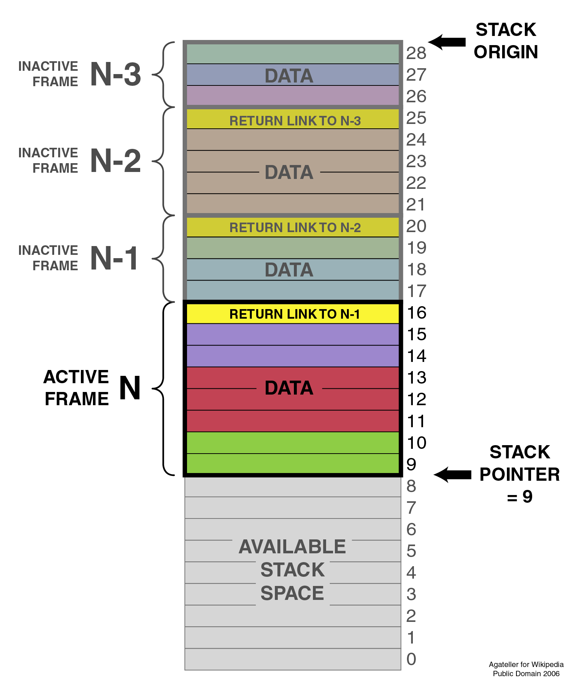

# <!--fit--> PV281: Programování v Rustu

---

# Obsah

- Cargo
- Binding & Shadowing
- Paměťový model 
- Borrow checker
- Vektory
- Práce s řetězci

---

# Cargo

- Vytváří nové projekty
- Spravuje závislosti
- Spouští testy
- Publikuje balíčky

---

# Založení projektu

```shell
cargo new nazev_projektu
```

V základu se založí projekt pro aplikaci (spustitelná binárka).

---

# Založení knihovny

```shell
cargo new nazev_projektu --lib
```

---

# Založení projektu v existující složce

```shell
mkdir nazev_projektu
cd nazev_projektu
cargo init
```

---

# Sestavení projektu

```shell
cargo build
```

Vytvoří složku `target` a v ní složku `debug`. Program je pomalejší, protože obsahuje více instrukcí. Získáme tím podporu debugování.

---

# Produkční sestavení projektu

```shell
cargo build --release
```

Takto vždy vytváříme aplikaci pro distubuci klientům nebo pro nasazení na server.

---

# Spuštění testů

```shell
cargo test
```

---

# Generování dokumentace

```shell
cargo doc
```

---

# Publikování balíčku

```shell
cargo publish
```

---

# Spuštění

```shell
cargo run options -- args
```

Argumenty před `--` jsou pro Cargo, argumenty za `--` se předávají našemu programu.

---

# rustfmt

Formátuje kód podle komunitního stylu a konvencí.

```shell
rustup component add rustfmt
```

```shell
cargo fmt
```

---

# clippy

Detekuje a případně opravuje další chyby v kódu.

```shell
rustup component add clippy
```

```shell
cargo clippy
```

---

# <!--fit--> To je ke Cargo pro dnešek vše, jdeme na kód

---

# Základní program

```rust
fn main() {
    println!("Hello, world!");
}
```

---

# Binding

```rust
fn main() {
    let x = 5; // toto je *binding*, v jiných jazycích *definice*
               // proměnná je imutabilní = neměnná = konstantní
    println!("Hodnota x je: {}", x);
    
    // x += 5 by hodilo chybu
    // x = 10 by taktéž hodilo chybu
    
    let y: u32 = 6;
    println!("Hodnota y je: {}", y);
}
```

---

# <!--fit--> Co když potřebujeme změnit hodnotu v proměnné?

---

# Mut binding

```rust
fn main() {
    let mut x = 5; // díky klíčovému slovu *mut* můžeme hodnotu měnit
    println!("Hodnota x je: {}", x);
        
    x = 10;
    println!("Hodnota x je: {}", x);
    
    
    x += 1; // hned na začátek si raději řekneme, že Rust nemá 
            // inkrementaci (žádné x++ nebo ++x)
    println!("Hodnota x je: {}", x);
}
```

---

# Shadowing

```rust
fn main() {
    let x = 5;
    println!("Hodnota x je: {}", x);
    
    let x = x + 5; // použitím let překryjeme původní proměnnou
                   // vzniká nová položka na stacku
    println!("Hodnota x je: {}", x);
}
```

---

# <!--fit--> Datové typy

---
# Celočíselné typy

| Velikost | Znaménkový    | Neznaménkový  |
| -------- | ------------- | ------------- |
| 8 bitů   | i8            | u8 |
| 16 bitů  | i16           | u16 |
| 32 bitů  | i32           | u32 |
| 64 bitů  | i64           | u64 |
| 128 bitů | i128          | u128 |
| dle architektury | isize | usize |

Výchozí je ```i32```.

---
# Zápisy literálů

| Velikost | Příklad |
| -------- | ------------- |
| desítkové   | 98_222 |
| šestnáctkové | 0xff |
| osmičkové  | 0o77 |
| binární  | 0b1111_0000 |
| bajtové | b'A' |

---

# Přetypování celočíselných typů

```rust
let x: u32 = 2;

// prevod na vetsi
let y: i64 = x as i64;

// prevod na mensi
let z = i32::try_from(y).unwrap_or(0);
```

---
# S plovoucí řádovou čárkou (IEEE-754)
| Velikost | Typ |
| -------- | --- |
| 32 bitů  | f32 |
| 64 bitů  | f64 |

Výchozí je `f64`.

---

# Přetypování desetinných čísel

```rust
fn main() {
    let x = 2;
    let y: f64 = x as f64;
    let z: i32 = y as i32;
    
    let u: i32 = y.trunc();
    let v: i32 = y.ceil();
    let w: i32 = y.floor();

    println!("Hodnota x je: {}", x);
    println!("Hodnota y je: {}", y);
    println!("Hodnota z je: {}", z);
}
```

Při přetypování f64 na f32 při přetečení je nastavena hodnota INFINITY nebo NEG_INFINITY.

---

# Přetypování boolu

```rust
fn main() {
    let t = true;

    let f: bool = false; // explicitní typ
    
    let value: i32 = f as i32; // bool je v Rustu vždy 0 nebo 1, nic jiného
}
```

---

# <!--fit--> Práce s pamětí

---

# Rozdělení paměti (C programy)


---

# Stack

Stack je vždy samostatný pro každé vlákno.
Jde o lineární paměť určité velikosti, data jsou vždy pevné velikosti.

Pro zajímavost:
1. Vlákno v Rustu má defaultně 2MB
2. Windows standardně dává 1MB, Linux oproti tomu 8MB

Velikost vlákna: `sys::thread::DEFAULT_MIN_STACK_SIZE`

---



---

# Heap

Používáme pro data proměnné velikosti nebo data větší velikost, která necheme programovat. Heap je sdílený mezi vlákny. Částo programovací jazyky využívají několik heapů.

Rust dává k dispozici jeden heap ve stable. Nemůžete změnit alokátor. V nightly to jde, ale pokud netvoříte OS, tak to nedělejte.

Práce se stakem je obvykle jednodušší a efektivnější než práce s haldou:
(Dynamic storage allocation: A survey and critical review.)[https://citeseerx.ist.psu.edu/viewdoc/summary?doi=10.1.1.143.4688]

---

# Box pro alokaci na haldě

```rust
fn main() {
    let b = Box::new(5);
    println!("b = {}", b);
}
```

---

# Statická paměť

Existuje po celou dobu běhu programu. Obsahuje kód programu, který je obvykle neměnný. Také obsahuje proměnné, které jsou označeny jako statické. Nemůžou být dealokovány do konce programu. Obsahuje také např. stringové literály.

---

# Ownership

Práce s pamětí měla dva tábory. Jedni používali garbage collector, který se postaral o paměť, ale ubral z výkonu. Druzí se starali o paměť manuálně, aby docílili nejvyššího výkonu, ale za cenu možných problémů.

Rust spojuje oba světy dohromady. Zároveň díky svým pravidlům (omezením jak pracujeme s pointery) zabraňuje deadlocku.

---

Vychází z principu `RAII` (Resource Acquisition Is Initialization). Ale enforcovaný překladačem.

---

# High level model

- o proměnných přemýšlíme jako o pojmenovaních hodnot
- proměnná existuje tak dlouho dokud drží vlastnictví hodnoty
- můžeme vytvořit závislosti vypůjčením si hodnoty
- existuje tok životem proměnné přes závislosti (flow)
- toku závislostí se může větvit (neplatí pro mutovatelné výpujčky)

---

# Ownership model

- všechny hodnoty mají jednoho vlastníka
- pouze jedno místo (scope) je zodpovědné za uvolnění paměti
- uvolnění paměti probíhá automaticky
- pokud je hodnota přesunuta (do nové proměnné, do vektoru, na haldu...), přesouvá se vlastnictví a starý vlastník už k hodnotě nemůže přistupit

---

# Přesun vlastníctví
(move ownership na zásobníku)

```rust
fn main() {
    let x = 5;
    let y = x; // x uz dale nejde pouzit
}
```

---

# Přesun vlastníctví na haldě

```rust
fn main() {
    let s1 = String::from("hello");
    let s2 = s1; // s1 uz dale nejde pouzit
}
```

Tímto dojde ke zkopírování ukazatele na stejné místo v paměti

---

# Klonování

Pokud potřebujeme data na haldě zkopírovat, tak musíme klonovat.

```rust
fn main() {
    let s1 = String::from("hello");
    let s2 = s1.clone();

    println!("s1 = {}, s2 = {}", s1, s2);
}
```

---

# Převod vlastníctví ve scopu

```rust
let x = vec![10, 20, 30];
if c {
    f(x); // vlastnictví x převedeno do f()
} else {
    g(x); // vlastnictví x převedeno do g()
}
h(x); // chyba při kompilaci. x už patří někomu jinému

```

---

# Vlastnictví - převzetí a vrácení

```rust 
fn main() {
    let s1 = String::from("hello");

    let (s2, len) = calculate_length(s1);

    println!("Byte length of '{}' is {}.", s2, len);
}

fn calculate_length(s: String) -> (String, usize) {
    let length = s.len(); // len() vrací bajtovou velikost

    (s, length)
}
```

---

# Převod vlastnictví a indexy

```rust 
let mut v = Vec::new();
for i in 1 .. 42 {
    v.push(i.to_string());
}

let third = v[2]; // chyba, vektor zůstává stále vlastníkem
let fifth = v[4]; // a tady taky chyba
```

---

# Řešení kopírováním

```rust
let mut v = Vec::new();
for i in 1 .. 42 {
    v.push(i.to_string());
}

let third = v[2].clone();
let fifth = v[4].clone();
```

---

# Borrowing: použití sdílené reference

Vlastník se nemění, půjčujeme si objekt s tím, že se nebude modifikovat.

```rust 
fn main() {
    let s1 = String::from("hello");

    let len = calculate_length(&s1);

    println!("Byte length of '{}' is {}.", s1, len);
}

fn calculate_length(s: &String) -> usize {
    s.len()
}
```

Pozn. &s1 vyslovujeme jako ref s1

---

# Borrowing: použití exkluzivní reference

Můžeme si objekt vypůjčit s úmyslem ho změnit. Na to použijeme mutabilní referenci.

```rust 
fn main() {
    let mut s = String::from("hello");

    change(&mut s);
}

fn change(some_string: &mut String) {
    some_string.push_str(", world");
}
```

---

# Jak funguje borrow checker 

1. Můžeme vytvořit neomezeně immutabilních referencí
2. Můžeme mít pouze jednu mutabilní referenci
3. Nekombinujeme mutabilní a immutabilní
4. Odkaz musí být platný
5. Složitější věci s lifetime příště, typy které to porušují přespříště

---

# Co nedělat u referencí

```rust 
fn main() {
    let mut s = String::from("hello");

    let r1 = &s; // žádný problém
    let r2 = &s; // taky žádný problém
    let r3 = &mut s; // VELKÝ PROBLÉM

    // důvodem problému je následující řádek
    println!("{}, {}, and {}", r1, r2, r3); 
}
```

---

# Jak vyřešit potřebu různých typů referencí?

```rust 
fn main() {
    let mut s = String::from("hello");

    let r1 = &s; // žádný problém
    let r2 = &s; // taky žádný problém
    println!("{} and {}", r1, r2);
    // r1 a r2 se dále nepoužívájí, takže žádný problém nebude

    let r3 = &mut s; // a tady to už problém není
    println!("{}", r3);
}
```

---

# Vektor

1. Souvislý blok paměti stejně jako pole. 
2. Narozdíl od pole je uložený na haldě. 
3. Nejde o linkovaný seznam. Ten najdete jako std::collections::LinkedList.

---

# Vytvoření vektoru

```rust
fn main() {
    // immutable pomocí makra
    let v = vec![1, 2, 3];

    // mutable vektory
    let mut v = Vec::new();

    v.push(5);
    v.push(6);
    v.push(7);
    v.push(8);
}
```

---

# Získávání položek

```rust
fn main() {
    let v = vec![1, 2, 3, 4, 5];

    let third: &i32 = &v[2];
    println!("The third element is {}", third);

    match v.get(2) {
        Some(third) => println!("The third element is {}", third),
        None => println!("There is no third element."),
    }
}

```

---

# Procházení vektoru

```rust
fn main() {
    let v = vec![100, 32, 57];
    for i in &v {
        println!("{}", i);
    }

    let mut w = vec![100, 32, 57];
    for i in &mut w {
        *i += 50;
    }
}

```
---

# <!--fit--> Práce se stringy

---

# Problémy práce se stringy

Ve většině jazyků je práce s typem string jednoduchá. V Rustu je složitější a je častým zdrojem problémů pro začátečníky.

Pod pokličkou jsou řetězce relativně komplexní ve všech jazycích.

---

# Stringové literály

Stringové literály jsou uzavřené v uvozovkách. Typicky jsou uložené v read-only části paměti s kódem. Dostáváme ho v typu &str (nazýváme "stir" nebo "string slice").

```rust
let joke = "Někdy je lepší zůstat v pondělí v posteli než celý týden ladit pondělní kód.";
```

Pokud potřebujeme uvozovky, tak musíme escapovat ```\"```

---

# Víceřádkové literály

Tento řetězec se vytiskne na více řádek. Mezery ze začátku řádku jsou součástí.

```rust
println!("Zákazník: “Mám nainstalovaný Windows 95.“
          Hotline : \"OK.\"
          Zákazník: \"Počítač mi nefunguje.\"
          Hotline : \"Ano, to jste už říkal...\"");
```

---

# Víceřádkové literály

Pokud se chceme zbavit bílých znaků na začku a nového řádku, tak použijeme ```\```

```rust
println!("Zákazník: “Mám nainstalovaný Windows 95.“ \
          Hotline : \"OK.\"
          Zákazník: \"Počítač mi nefunguje.\" \
          Hotline : \"Ano, to jste už říkal...\"");
```

---

# Raw string literal

V některých situacích může být nepříjmené neustále escapeovat ```\```. Třeba u cest ve Windows.

```rust
let default_path = r"C:\Program Files\Moje Rust appka\";
```

Raw string tím pádem neumožní escapovat a použít uvozovky.
Pozn. ikdyž je tu ukázaná cestka, tak lepří je použít ```std::path::PathBuf``` and ```&Path```.

---

# Raw string literal

Existuje zápis raw stringu, který uvozovku umožní.

```rust
let default_path = r###"C:\"Program Files"\"Moje Rust appka"\"###;
```

---

# Byte string literal

Pokud potřebujeme mát string jako pole znaků (slice ```u8``` hodnot):

```rust
let method = b"GET";
assert_eq!(method, &[b'G', b'E', b'T']);
```

Řetězcovou syntaxi můžeme kombinovat. Pomocí ```br"``` vytvoříme raw byte string.
Byte string nemůže obsahovat Unicode znaky.

---

# String

String v Rustu nefunguje jako v C, kde máme řetězec znaku zakončený prázdným znakem. V Rustu může být prázdný znak klidně uprostřed řetězce. Pozn. CString pro C variantu.

String:
- používá variabilní kódování UTF-8. 
- je uložený na haldě
- implementovaný jako Vec<u8>, můžeme ho považovat za buffer proměnné velikosti
- je mutable

---

# String a &str

Stringový literál &str můžeme použít pro vytvoření stringu. Typicky se používá metoda ```String::from()```. 

Pro vytoření za runtimu můžeme připravit buffer pomocí ```String::new()``` a nebo ```String::with_capacity()```. Maximum je usize::MAX, na 32-bit plaformě isize::MAX. Pozn. new má výchozí kapacitu 0. Při 0 nedojde k alokaci. 

---

# Převod mezi string a &str

```rust 
fn main() {
    let hello_str: &str = "hello";

    let hello_string: String = String::from("hello");

    let hello_string_from_str: String = hello_str.to_string();
    let hello_string_from_str: String = "hello".to_string();

    let hello_str_from_string: &str =  &hello_string;
    let hello_str_from_string: &str =  hello_string.as_str();
}
```

---

# Slice

```rust 
fn main() {
    let s = String::from("hello world");

    let hello: &str = &s[0..5];
    let world: &str = &s[6..11];

    let hello = &s[..5];
    let world = &s[6..];
}
```

---

# Délka stringu

Funkce ```len()``` vrací počet bajtů. Pro počet znaku na to musíme přes ```chars()```.

```rust
assert_eq!("ಠ_ಠ".len(), 7);
assert_eq!("ಠ_ಠ".chars().count(), 3);
```

---

# Porovnání stringu

Dělá se pomocí ```==``` a ```!=```. Řetězce musí obsahovat stejné znaky ve stejném pořadí. Neporovnávají se adresy paměti.

```rust
assert!("ONE".to_lowercase() == "one");
```

---

# Konkatenace

```rust 
fn main() {
    let concat_with_function: String = ["Hello", " world"].concat(); 

    let join_strings: String = ["Hello", "world"].join(" "); 

    // this is the most common and the most flexible way
    let concat_with_format: String = format!("{} {}", "Hello", " world");
    
    // 2nd+ variables must be string slices or references to Strings
    let hello = String::from("Hello");
    let world = String::from("world");
    let hello_world_concat_plus: String = hello + " " + &world;
}
```

---

# Použití jako buffer

```rust 
fn main() {
    let mut my_string = String::new();
    my_string.push_str("hello");
    my_string.push('!');
}
```

---

# Práce se znaky

```rust 
fn main() {
    let pangram: &'static str = "the quick brown fox jumps over the lazy dog";

    // Copy chars into a vector, sort and remove duplicates
    let mut chars: Vec<char> = pangram.chars().collect();
    chars.sort();
    chars.dedup();

     // Create an empty and growable `String`
    let mut string = String::new();
    for c in chars {
        // Insert a char at the end of string
        string.push(c);
        // Insert a string at the end of string
        string.push_str(", ");
    }
}
```

---

# Další užitečné metody

```rust
assert!("peanut".contains("nut"));
assert_eq!("ಠ_ಠ".replace("ಠ", "■"), "■_■");
assert_eq!("    clean\n".trim(), "clean");

for word in "veni, vidi, vici".split(", ") {
    assert!(word.starts_with("v"));
}
```

---

# Vytvoření z byte stringu

```rust 
fn main() {
    let raw_bytestring = br"\u{211D} is not escaped here";

     // Converting a byte array to `str` can fail
    if let Ok(my_str) = str::from_utf8(raw_bytestring) {
        println!("And the same as text: '{}'", my_str);
    }
}
```

---

# Doporučení pro práci s řetězci

- Parametry funkce by měli přijímat slice (&str)
- Pro práci s cestou je doporučené použít ```std::path::PathBuf``` a ```&Path```
- Pro binární data s kódování jiným než UTF-8 ```Vec<u8>``` a ```&[u8]```
- Pro práci se stringy z OS (např. argumenty CMD) ```OsString``` a ```&OsStr```
- Pro interoperatibilitu s C knihovnami ```CString``` a ```&CStr```

``````

---

# <!--fit--> Dotazy?

---

# <!--fit--> Děkuji za pozornost

