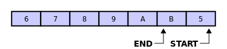
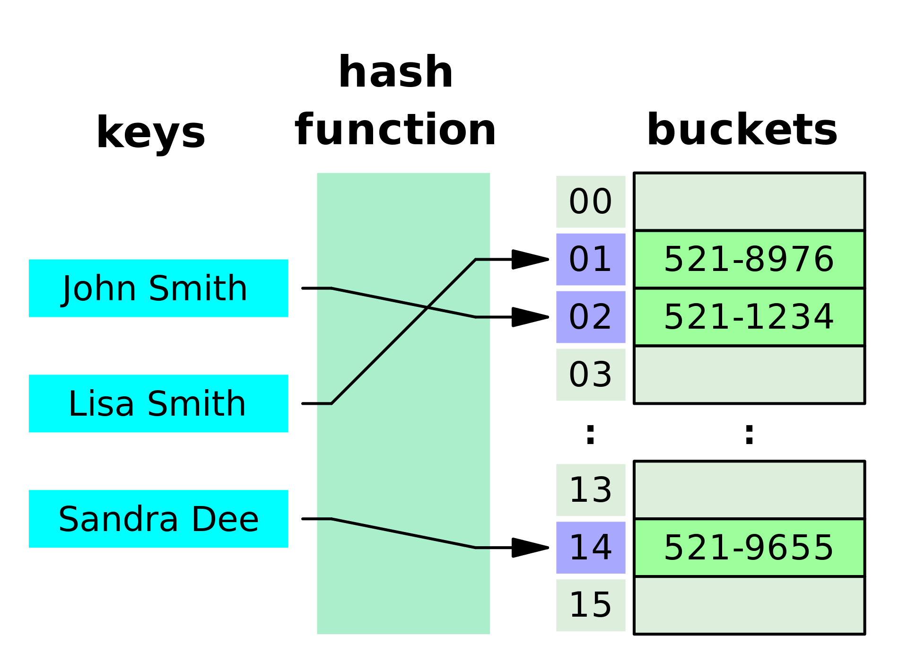

# <!--fit--> PV281: Programování v Rustu

---

# Obsah

?. Práce se soubory
1. Generika
2. Utility traity
3. Operator overloading
1. Vektory
2. Iterátory
3. Hashová tabulka
4. Množina
5. Halda

---

# Připomenutí vektorů

Souvislý blok paměti, uložený na haldě, lze měnit jeho velikost.

```rust
fn main() {
    let values = vec![1, 2, 3];
    let values = vec![0; 64];

    let mut values = Vec::new();
    values.push(1);
    values.push(2);
    
    match values.get(2) {
        Some(third) => println!("The third element is {}", third),
        None => println!("There is no third element."),
    }
    
    for value in &values {
        println!("{}", value);
    }
}
```

---

# Iterátor

Jde o trait, který dává následující položku.
Vrácená položka je typu `Option`. Podle toho poznáme, jestli jsme na konci.

```rust
pub trait Iterator {
    type Item;

    fn next(&mut self) -> Option<Self::Item>;
    
    // ...
}
```

---

# Iterátor nad vektorem

Vektor implementuje trait `Iterator`. 
Můžeme využít funkce `.iter()`.

```rust
fn main() {
    let values = vec![1, 2, 3];

    let iterator = v1.iter();

    // `.iter()` lze využít i ve for cyklu
    for value in iterator {
        println!("Got: {}", val);
    }
}
```

---

# Closure

Anonymní funkce. Z jiných jazyků znáte jako _lambda funkce_.

```rust
fn main() {
    let closure_annotated = |i: i32| -> i32 { i + 1 };
    let closure_inferred  = |i     |          i + 1  ;

    let i = 1;
    
    println!("closure_annotated: {}", closure_annotated(i));
    println!("closure_inferred: {}", closure_inferred(i));

    let closure_parameterless = || 1;
    println!("closure returning one: {}", closure_parameterless());
}
```

---

# Closure jako vstupní parametr

Argumenty funkcí musí být vždy explicitně otypovány.
Typ closure jakožto parametru musí být jeden z následujících traitů:

`Fn`: closure používá své parametry jako reference (`&T`)
`FnMut`: closure používá své parametry jako mutable reference
(`&mut T`)
`FnOnce`: closure se stává vlastníkem svých parametrů (`T`)

---

# Closure jako vstupní parametr

```rust
// Funkce, která bere closure jako parametr a zavolá ji.
// Poznámka: F je typické písmeno generického typu pro otypování closure.
fn apply<F>(f: F)
where
    // Samotná closure nemá žádné vstupní parametry a nic nevrací
    F: FnOnce(),
{
    f();
}

// Funkce, který bere closure jako parametr a vrací `i32`.
fn apply_to_3<F>(f: F) -> i32
where
    // Samotná closure bere i vrací `i32`.
    F: Fn(i32) -> i32
{
    f(3)
}

// TODO: zkuste si zaměnit `FnOnce()`, `Fn()` a `FnMut()` v kódu výše.
```

---

# Metody pracující s iterátory

2. Metody produkující jiný iterátor
1. Metody konzumující iterátor

---


### Map

Funkcionální přístup k iterování: na každý prvek iterátoru se zavolá closure, výsledkem je nový iterátor s modifikovanými prvky.

```rust
fn main() {
    let a = [1, 2, 3];

    // typem parametru metody `.map()` je `F: FnMut(Self::Item) -> B`
    let mut iter = a.iter().map(|x| 2 * x);

    assert_eq!(iter.next(), Some(2));
    assert_eq!(iter.next(), Some(4));
    assert_eq!(iter.next(), Some(6));
    assert_eq!(iter.next(), None);
}
```
---

### Filter

Výsledkem je nový iterátor, jehož prvky tvoří podmnožinu prvků původních.

```rust
fn main() {
    let a = [1, 4, 2, 3];

    let sum = a.iter()
        .cloned() // duplikuje položky
        .inspect(|x| println!("about to filter: {}", x))
        .filter(|x| x % 2 == 0)
        .inspect(|x| println!("made it through filter: {}", x))
}
```

---

### Enumerate

Transformuje iterátor na iterátor dvojic: index a prvek.

```rust
fn main() {
    let a = ['a', 'b', 'c'];

    let mut iter = a.iter().enumerate();

    assert_eq!(iter.next(), Some((0, &'a')));
    assert_eq!(iter.next(), Some((1, &'b')));
    assert_eq!(iter.next(), Some((2, &'c')));
    assert_eq!(iter.next(), None);
}
```

Poznámka: index je typu `usize`, pro vlastní typ použijte `zip()`.

---

### Skip

Přeskočí prvních _n_ prvků.

```rust
fn main() {
    let a = [1, 2, 3];

    let mut iter = a.iter().skip(2);

    assert_eq!(iter.next(), Some(&3));
    assert_eq!(iter.next(), None);
}
```

---

### Take

Vezme prvních _n_ prvků.

```rust
fn main() {
    let a = [1, 2, 3];

    let mut iter = a.iter().take(2);

    assert_eq!(iter.next(), Some(&1));
    assert_eq!(iter.next(), Some(&2));
    assert_eq!(iter.next(), None);
}
```

---

### Fold

Bere iniciální hodnotu akumulátoru a closure o dvou parametrech. Iterátor je zkonzumován.

```rust
fn main() {
    let a = [1, 4, 2, 3];

    let sum = a.iter()
        .cloned()
        .filter(|x| x % 2 == 0)
        .fold(0, |sum, i| sum + i);

    println!("{}", sum);
}
```

---

### Zip

```rust
#![feature(iter_zip)]
use std::iter::zip;

fn main() {
    let xs = [1, 2, 3];
    let ys = [4, 5, 6];
    for (x, y) in zip(&xs, &ys) {
        println!("x:{}, y:{}", x, y);
    }

    // Nested zips are also possible:
    let zs = [7, 8, 9];
    for ((x, y), z) in zip(zip(&xs, &ys), &zs) {
        println!("x:{}, y:{}, z:{}", x, y, z);
    }
}
```

---

# Spojení dvou polí přes zip()

```rust
fn main() {
    // jak bylo předtím zmíněno enumerate
    let enumerate: Vec<_> = "foo".chars().enumerate().collect();

    // tak dosažení tohotéž přes zip
    let zipper: Vec<_> = (0..).zip("foo".chars()).collect();

    assert_eq!((0, 'f'), enumerate[0]);
    assert_eq!((0, 'f'), zipper[0]);

    assert_eq!((1, 'o'), enumerate[1]);
    assert_eq!((1, 'o'), zipper[1]);

    assert_eq!((2, 'o'), enumerate[2]);
    assert_eq!((2, 'o'), zipper[2]);
}
```

---

# Pro side efekty je vhodnější použít for cyklus.

---

# Zpět k datovým strukturám

---

# Dvousměrný vektor 

Využijeme v případě kdy:
1. potřebujeme vkládat na začátek
2. chceme frontu
3. chceme obousměrnou frontu

Je implementován jako ring buffer. Tj. nemusí mít kontinuální prostor v paměti. Pokud chceme dělat slice, tak musíme mít kontinuální prostor. Na jeho získání jde využít funkce make_contiguous

---

# Ring buffer



---

# Dvousměrný vektor 

```rust
fn main() {
    use std::collections::VecDeque;

    let mut buf = VecDeque::new();
    buf.push_back(3);
    buf.push_back(4);
    buf.push_back(5);
    buf.push_front(2);
    if let Some(elem) = buf.get_mut(2) {
        *elem = 7;
    }

    assert_eq!(d.pop_front(), Some(2));
    assert_eq!(buf[1], 7);
}
```

---

# Hashtable

Využití:
1. slovník
2. cache

Implementovaná podle Google SwissTable. Jako hashovací funkci používá SipHash 1-3. Ta je vhodná pro středně velké slovníky a je odolná na HashDoS útoky.
Pro malé a velké hashovací tabulky je vhodnější použít jinou hashovací funkci.

---

# Hashtable



---

# Hashtable

```rust
fn main() {
    use std::collections::HashMap;

    let mut scores = HashMap::new();

    scores.insert(String::from("Blue"), 10);
    scores.insert(String::from("Yellow"), 50);
    
    // vložení jen pokud klíč neexistuje
    scores.entry(String::from("Yellow")).or_insert(50);
    scores.entry(String::from("Blue")).or_insert(50);

    let team_name = String::from("Blue");
    let score = scores.get(&team_name);
}

```

---

# Hashtable - ukázka 2

```rust
fn main() {
    let mut book_reviews = HashMap::new();

    // Review some books.
    book_reviews.insert(
        "Adventures of Huckleberry Finn".to_string(),
        "My favorite book.".to_string(),
    );
    
    if !book_reviews.contains_key("Les Misérables") {
        println!("We've got {} reviews, but Les Misérables ain't one.",
                book_reviews.len());
    }

    // oops, this review has a lot of spelling mistakes, let's delete it.
    book_reviews.remove("The Adventures of Sherlock Holmes");

    // Look up the values associated with some keys.
    let to_find = ["Pride and Prejudice", "Alice's Adventure in Wonderland"];
    for &book in &to_find {
        match book_reviews.get(book) {
            Some(review) => println!("{}: {}", book, review),
            None => println!("{} is unreviewed.", book)
        }
    }
}
```

---

# Množina

Množinu často využíváme v algoritmech, které si zaznamenávají prošlé prvky.
Ale jinak kdykoliv, kdy potřebujeme mít hodnotu uloženou pouze jednou.

Nejrychlejší implementace je HashSet. To platí ale jen do chvíle než potřebujeme mít položky sežezené. Potom už použijeme BTreeMap.

---

# Hašová množina

```rust
fn main() {
    use std::collections::HashSet;
    // Type inference lets us omit an explicit type signature (which
    // would be `HashSet<String>` in this example).
    let mut books = HashSet::new();

    // Add some books.
    books.insert("A Dance With Dragons".to_string());
    books.insert("To Kill a Mockingbird".to_string());
    books.insert("The Odyssey".to_string());
    books.insert("The Great Gatsby".to_string());

    // Check for a specific one.
    if !books.contains("The Winds of Winter") {
        println!("We have {} books, but The Winds of Winter ain't one.",
                books.len());
    }

    // Remove a book.
    books.remove("The Odyssey");
}


```

---

# B-strom

Použijeme pokud:
1. Chceme mapu seřazenou podle klíčů
2. Pokud cheme získávat položky v rozsahu
3. Pokud potřebuje rychle získát nejmenší nebo největší položku
4. Pokud potřebujeme najít klíče, které jsou větší nebo menší než jiný

---

# BTreeMap

```rust
fn main() {
    use std::collections::BTreeMap;

    // type inference lets us omit an explicit type signature (which
    // would be `BTreeMap<&str, u8>` in this example).
    let mut player_stats = BTreeMap::new();

    fn random_stat_buff() -> u8 {
        // could actually return some random value here - let's just return
        // some fixed value for now
        42
    }

    // insert a key only if it doesn't already exist
    player_stats.entry("health").or_insert(100);

    // insert a key using a function that provides a new value only if it
    // doesn't already exist
    player_stats.entry("defence").or_insert_with(random_stat_buff);

    // update a key, guarding against the key possibly not being set
    let stat = player_stats.entry("attack").or_insert(100);
    *stat += random_stat_buff();
}


```

---

# BTreeMap

```rust
fn main() {
    use std::collections::BTreeMap;

    // type inference lets us omit an explicit type signature (which
    // would be `BTreeMap<&str, &str>` in this example).
    let mut movie_reviews = BTreeMap::new();

    // review some movies.
    movie_reviews.insert("Office Space",       "Deals with real issues in the workplace.");
    movie_reviews.insert("Pulp Fiction",       "Masterpiece.");
    movie_reviews.insert("The Godfather",      "Very enjoyable.");
    movie_reviews.insert("The Blues Brothers", "Eye lyked it a lot.");

    // check for a specific one.
    if !movie_reviews.contains_key("Les Misérables") {
        println!("We've got {} reviews, but Les Misérables ain't one.",
                movie_reviews.len());
    }

    // on next slide...
}


```

---

# BTreeMap

```rust
fn main() {
    // code from pred slide ...


    // oops, this review has a lot of spelling mistakes, let's delete it.
    movie_reviews.remove("The Blues Brothers");

    // look up the values associated with some keys.
    let to_find = ["Up!", "Office Space"];
    for movie in &to_find {
        match movie_reviews.get(movie) {
        Some(review) => println!("{}: {}", movie, review),
        None => println!("{} is unreviewed.", movie)
        }
    }

    // Look up the value for a key (will panic if the key is not found).
    println!("Movie review: {}", movie_reviews["Office Space"]);

    // iterate over everything.
    for (movie, review) in &movie_reviews {
        println!("{}: \"{}\"", movie, review);
    }
}


```

---

# Halda

Využívá se jako prioritní fronta a nebo pokud potřebujeme zpracovat největší/nejdůležitejší položku.

---

# Halda

```rust
fn main() {
    use std::collections::BinaryHeap;

    // Type inference lets us omit an explicit type signature (which
    // would be `BinaryHeap<i32>` in this example).
    let mut heap = BinaryHeap::new();

    // We can use peek to look at the next item in the heap. In this case,
    // there's no items in there yet so we get None.
    assert_eq!(heap.peek(), None);

    // Let's add some scores...
    heap.push(1);
    heap.push(5);
    heap.push(2);

    // continues on next slide 
}

```

---

# Halda

```rust
fn main() {
    // continued from prev slide

    // Now peek shows the most important item in the heap.
    assert_eq!(heap.peek(), Some(&5));

    // We can check the length of a heap.
    assert_eq!(heap.len(), 3);

    // We can iterate over the items in the heap, although they are returned in
    // a random order.
    for x in &heap {
        println!("{}", x);
    }

    // If we instead pop these scores, they should come back in order.
    assert_eq!(heap.pop(), Some(5));
    assert_eq!(heap.pop(), Some(2));
    assert_eq!(heap.pop(), Some(1));
    assert_eq!(heap.pop(), None);

    // We can clear the heap of any remaining items.
    heap.clear();

    // The heap should now be empty.
    assert!(heap.is_empty())
}


```

---

# Pro rozšíření možností iterátoru 

využijte crate [itertools](https://docs.rs/itertools/0.10.1/itertools/#)

---

# Pro jednoduchou paralelizaci na úrovni iterátoru

využijte crate [Rayon](https://github.com/rayon-rs/rayon)

---

# Instalace Rayon

Do Cargo.toml přidáme závislost: 
```toml
[dependencies]
rayon = "1.5"
```

---

# Použití

Funkci iter() nahradíme za par_iter()
```rust
use rayon::prelude::*;
fn sum_of_squares(input: &[i32]) -> i32 {
    input.par_iter() // <-- just change that!
         .map(|&i| i * i)
         .sum()
}
```

---

# <!--fit--> Dotazy?

---

# <!--fit--> Děkuji za pozornost

