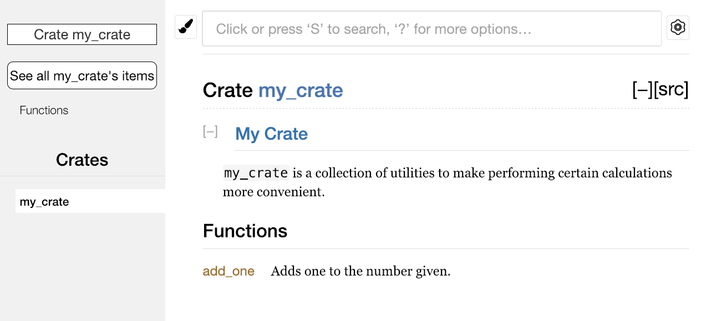
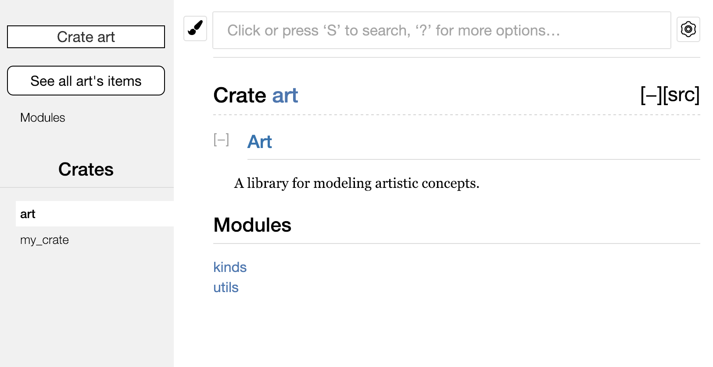

# <!--fit--> PV281: Programování v Rustu

---

# Obsah

1. Smart Pointer
2. Crates
3. Moduly
4. Testování
5. Dokumentace

---

# <!--fit--> Smart Pointery

---

# Pro připomenutí

1. Máme _stack_, který se uklízí automaticky na konci funkce.
2. Máme _heap_, kde máme velké objekty, objekty s neznámou velikostí za překladu a data, která nám musí přežít dlouho.
3. Heap se uklízí. V jiných jazycích to dělá _garbage collector_; v Rustu instrukce pro čištění dodá překladač.

---

#### Pointer
Základní odkaz na místo v paměti. Všechna omezení jsou definovaná _borrow checkerem_.
<br />
#### Smart Pointer
Chování odpovídá základnímu pointeru, ale dle varianty má další metadata a schopnosti.

---

# Smart Pointer

Smart Pointer je struktura. Implementuje trait `Deref` a `Drop`. Je vlastníkem dat, na která odkazuje.

Poznámka: `String` je smart pointer, např. kapacitu si drží jako metadata. Datové struktury, jako např. `Vec<T>`, jsou také smart pointery.

---

<!-- _class: split -->

### Deref coercion

<div class=common-text>

Automatický převod mezi referencemi parametrů funkcí/metod. Trait `Deref` umožňuje používat operátor dereference <code>*</code>.

</div>

<div class=left-column>

```rust
use std::ops::Deref;

struct DerefExample<T> {
    value: T
}

impl<T> Deref for DerefExample<T> {
    type Target = T;

    fn deref(&self) -> &Self::Target {
        &self.value
    }
}
```

</div>
<div class=right-column>

```rust
fn main() {
    let x = DerefExample { value: 'a' };
    
    assert_eq!('a', *x);
}
```

</div>

---

### Kde je operátor `->`?

V jazycích C a C++ se rozlišuje mezi `.` a `->` tak, že následující zápisy jsou ekvivalentní:

```c++
object->something();
(*object).something();
```

Rust při volání `object.something()` automaticky přidává `&`, `&mut`, či `*`, aby `object` typově odpovídal signatuře `something()`:

```rust
p1.distance(&p2);
(&p1).distance(&p2);
```

---

<!-- _class: split -->

### Drop

<div class=left-column>

```rust
struct CustomSmartPointer {
    data: String,
}

impl Drop for CustomSmartPointer {
    fn drop(&mut self) {
        println!
            "Dropping CustomSmartPointer with data `{}`!",
            self.data
        );
    }
}

fn main() {
    let c = CustomSmartPointer {
        data: String::from("my stuff"),
    };
    let d = CustomSmartPointer {
        data: String::from("other stuff"),
    };
    println!("CustomSmartPointers created.");
}
```

</div>
<div class=right-column>

```shell
$ cargo run

CustomSmartPointers created.
Dropping CustomSmartPointer with data `other stuff`!
Dropping CustomSmartPointer with data `my stuff`!
```

</div>


---

# Varianty smart pointerů

#### Box&lt;T>
#### Cell&lt;T>
#### RefCell&lt;T>
#### Rc&lt;T>
#### Ref&lt;T>
#### RefMut&lt;T>

---

# Box&lt;T>

Je nejjednodušším smart pointerem. Ukládá data na haldě (nikoli na zásobníku) i ve chvíli, kdy je jejich velikost známá za překladu. Samotný pointer může být na zásobníku, ale data ne.

Hodí se nám ve chvíli, kdy potřebujeme udělat rekurzivní struktury.

---

# Box&lt;T>

```rust
#[derive(Debug)]
enum List<T> {
    Cons(T, Box<List<T>>),
    Nil,
}

fn main() {
    let list: List<i32> = List::Cons(1, Box::new(List::Cons(2, Box::new(List::Nil))));
    println!("{:?}", list);
}
```

```shell
$ cargo run

Cons(1, Cons(2, Nil))
```

---

# Cell&lt;T>

Umožňuje mutaci uvnitř imutabilní struktury. Má metody `get` a `set`. Metoda `get` vrací kopii dat.

Je vhodná pro menší data, a to z důvodu vracení kopie.

Je určena pouze pro jednovláknové použití. Vícevláknové alternativy budou v příští přednášce.

---

# Cell&lt;T>

```rust
use std::cell::Cell;

struct SomeStruct {
    regular_field: u8,
    special_field: Cell<u8>,
}

fn main() {
    let my_struct = SomeStruct {
        regular_field: 0,
        special_field: Cell::new(1),
    };

    let new_value = 100;

    // ERROR: `my_struct` is immutable.
    // my_struct.regular_field = new_value;

    // WORKS: although `my_struct` is immutable, `special_field` is a `Cell`, which can always be mutated.
    my_struct.special_field.set(new_value);
    assert_eq!(my_struct.special_field.get(), new_value);
}
```

---

# RefCell&lt;T>

Dává sdílený přístup k `T`, ale narozdíl od `Cell` je kontrolovaná za běhu.

Má metody, která vrací _mutabilní_ nebo _nemutabilní_ referenci. Musíme si sami napsat kontrolu, jestli se povedlo získat referenci.

Platí stejná pravidla pro získávání referencí jako při _borrow checkingu_ za překladu. Pokud ale pravidla porušíme, vlákno zpanikaří.

---

# RefCell&lt;T>

```rust
use std::cell::RefCell;

fn main() {
    let container = RefCell::new(11);
    
    {
        let _c = container.borrow();
        // You may borrow as immutable as many times as you want,...
        assert!(container.try_borrow().is_ok());
        // ...but cannot borrow as mutable because it is already borrowed as immutable.
        assert!(container.try_borrow_mut().is_err());
    } 
    
    // After the first borrow as mutable...
    let _c = container.borrow_mut();
    // ...you cannot borrow in any way.
    assert!(container.try_borrow().is_err());
    assert!(container.try_borrow_mut().is_err());
}
```

---

# Rc&lt;T>

Pokud potřebujeme více vlastníků, tak můžeme využít _reference counting_. Pokud existuje jakýkoliv odkaz, tak data nejsou uvolněna. 

`T` v `Rc` je imutabilní. Pokud chceme, aby se obsah dal měnit, tak musíme použít kombinace s `Cell` nebo `RefCell`.

Pokud tvoříme pomocí `Rc` cyklické vazby (např. obousměrné odkazy mezi potomkem a rodičem stromu), může dojít k _memory leaku_, protože čítač nikdy neklesne na 0.
Tehdy musíme použít `Weak<T>`, který není vlastníkem dat a ta mohou být odstraněna.

---

<!-- _class: split -->

### Rc&lt;T>

<div class=left-column>

```rust
use std::rc::Rc;
use List::{Cons, Nil}; // shorthand instead of using `List::Cons` everywhere

enum List {
    Cons(i32, Rc<List>),
    Nil,
}

fn main() {
    let a = Rc::new(Cons(5, Rc::new(Cons(10, Rc::new(Nil)))));
    println!("count after creating a: {}", Rc::strong_count(&a));
    
    let b = Cons(3, Rc::clone(&a));
    println!("count after creating b: {}", Rc::strong_count(&a));
    
    {
        let c = Cons(4, Rc::clone(&a));
        println!("count after creating c: {}", Rc::strong_count(&a));
    }
    println!("count after c is dropped: {}", Rc::strong_count(&a));
}
```

</div>
<div class=right-column>

```shell
$ cargo run

count after creating a: 1
count after creating b: 2
count after creating c: 3
count after c is dropped: 2
```

</div>

---

<!-- _class: split -->

### Kombinace Rc&lt;T> s RefCell&lt;U>

<div class=left-column>

```rust
#[derive(Debug)]
enum List {
    Cons(Rc<RefCell<i32>>, Rc<List>),
    Nil,
}

use List::{Cons, Nil};
use std::cell::RefCell;
use std::rc::Rc;

fn main() {
    let value = Rc::new(RefCell::new(5));

    let tail = Rc::new(Cons(Rc::clone(&value), Rc::new(Nil)));

    let head_1 = Cons(Rc::new(RefCell::new(3)), Rc::clone(&tail));
    let head_2 = Cons(Rc::new(RefCell::new(4)), Rc::clone(&tail));

    *value.borrow_mut() += 10; // borrow_mut vrací RefMut, proto je tu třeba *.

    println!("tail   = {:?}", tail);
    println!("head_1 = {:?}", head_1);
    println!("head_2 = {:?}", head_2);
}
```

</div>
<div class=right-column>

```shell
$ cargo run

tail   = Cons(RefCell { value: 15 }, Nil)
head_1 = Cons(RefCell { value: 3 }, Cons(RefCell { value: 15 }, Nil))
head_2 = Cons(RefCell { value: 4 }, Cons(RefCell { value: 15 }, Nil))
```

</div>

---

# Ref&lt;T>

Typ obalující imutabilně vypůjčenou hodnotu z `RefCell<T>`.

```rust
use std::cell::{Ref, RefCell};

fn main() {
    let cell:  RefCell<(u32, char)> = RefCell::new((5, 'b'));
    let ref_1: Ref<(u32, char)>     = cell.borrow();
    let ref_2: Ref<u32>             = Ref::map(ref_1, |t| &t.0);

    assert_eq!(*ref_2, 5);
    assert_eq!(*cell.borrow(), (5, 'b'));

    // ERROR: borrow of moved value: `ref_1`
    // assert_eq!(*ref_1, (5, 'b'));
}
```

---

# RefMut&lt;T>

Typ obalující mutabilně vypůjčenou hodnotu z `RefCell<T>`.

```rust
use std::cell::{RefCell, RefMut};

fn main() {
    let cell: RefCell<(u32, char)> = RefCell::new((5, 'b'));

    {
        let ref_1:     RefMut<(u32, char)> = cell.borrow_mut();
        let mut ref_2: RefMut<u32>         = RefMut::map(ref_1, |t| &mut t.0);

        assert_eq!(*ref_2, 5);
        *ref_2 = 42;
    }

    assert_eq!(*cell.borrow(), (42, 'b'));
}
```

---

# <!--fit--> Crates

---

# Crate

Crate je nejmenší jednotka kompilace, např. i soubor.
Crate může být **binary crate** nebo **library crate**.

Jako názorná ukázka toho, co to `crate` je, můžeme použít příkaz...

`cargo build --verbose`

---

# Crate

...nebo se stačí podívat na závislosti v `Cargo.toml`:

```toml
[dependencies]
num = "0.4"
image = "0.13"
crossbeam = "0.8"
```

---

# Externí závislost

V Rustu 2015 bylo nutné použít `extern crate`, od Rustu 2018 **už to potřeba není**. Jelikož se s tímto zápisem stále můžete setkat, tak jej zde ukazujeme:

```rust
extern crate pcre;

extern crate std; // equivalent to: extern crate std as std;

extern crate std as ruststd; // linking to 'std' under another name

extern crate hello_world; // if hyphen in package name then it is replaced with an underscore
                          // crate name cannot have hyphen

extern crate foo as _; // when only linked and not referenced
```

---

# Externí závislosti

Dnes nám stačí použít `use` (více o něm později):

```rust
use num::Complex;
use image::ColorType;
use image::png::PNGEncoder;
```

---

# Tranzitivní závislosti

Cargo si pří překladu stáhne zdrojový kód pro každou crate. Ta může záviset na dalších, tranzitivních závislostech. Vytvoří ze graf závislostí, který je cargem vyhodnocen a zpracován.

---

# Kompilace crate

Jednolivé crates jsou zkompilovány jako `.rlib`, která je následně staticky linkovaná do výsledné binárky.

---

# Podmíněná kompilace

```rust
// This function only gets compiled if the target OS is linux
#[cfg(target_os = "linux")]
fn are_you_on_linux() {
    println!("You are running linux!");
}

// And this function only gets compiled if the target OS is *not* linux
#[cfg(not(target_os = "linux"))]
fn are_you_on_linux() {
    println!("You are *not* running linux!");
}

fn main() {
    are_you_on_linux();

    println!("Are you sure?");
    if cfg!(target_os = "linux") {
        println!("Yes. It's definitely linux!");
    } else {
        println!("Yes. It's definitely *not* linux!");
    }
}
```

---

# Podmíněná kompilace – features

V Cargo.toml přídáme sekci `[features]`.

```toml
[features]
default = ["ico", "webp"]
bmp = []
png = []
ico = ["bmp", "png"]
webp = []
```

---

### Podmíněná kompilace –  features

A v kódu můžeme dle nastavení přidat části kódu.

```rust
#[cfg(feature = "webp")]
pub mod webp;
```

```rust
fn my_function() -> u32 {
    let x: u32 = 2;

    #[cfg(feature = "png")]
    {
        let y: u32 = 2;
        x + y
    }

    x
}
```

---

### Package

Package je "kolekce" alespoň jedné _crate_. Je definovaný v `Cargo.toml`. 
Package může obsahovat několik **binary crates** (další se umisťují do `src/bin/`) a nejvýše jednu **library crate**:

```sh
foo
├── Cargo.toml
└── src
    ├── main.rs
    ├── lib.rs
    └── bin
        └── my_other_bin.rs
```

---

# <!--fit--> Modularita

---

# Moduly

Slouží k orgranizaci kódu v rámci projektu. Můžete si je představit jako Rustovou obdobu pro `namespace`. Je to logický kontejner pro struktury, funkce, typy, ...

---

### Klíčové slovo mod

Vytvářejme `library crate` modelující restauraci:

```rust
/// noun: the part of a restaurant or hotel where the employees deal directly with customers.
mod front_of_house {
    mod hosting {
        fn add_to_waitlist() {}

        fn seat_at_table() {}
    }

    mod serving {
        fn take_order() {}

        fn serve_order() {}

        fn take_payment() {}
    }
}         
```

---

### Strom modulů

Obsah `src/main.rs` a `src/lib.rs` tvoří implicitní modul `crate` v kořeni modulového stromu:

```
crate
 └── front_of_house
     ├── hosting
     │   ├── add_to_waitlist
     │   └── seat_at_table
     └── serving
         ├── take_order
         ├── serve_order
         └── take_payment
```

Poznámka: výpis stromu utilitou [cargo-modules](https://crates.io/crates/cargo-modules/).

---

### Volání funkce z jiného modulu

Absolutní cesty začínají názvem crate nebo literálem `crate`.
Relativní cesty začínají klíčovými slovy `self`, `super` nebo názvem modulu.

```rust
mod front_of_house {
    mod hosting {
        fn add_to_waitlist() {}
    }
}

fn eat_at_restaurant() {
    crate::front_of_house::hosting::add_to_waitlist(); // Absolute path from the current crate
    
    name_of_the_crate::path::to::the::function(); // Absolute path from an external crate (dependency)

    front_of_house::hosting::add_to_waitlist();  // Relative path
}        
```

---

# Viditelnost

V Rustu jsou všechny položky (funkce, metody, struktury, enumy, moduly i konstanty) **private by default** vůči svému rodičovskému modulu.

To znamená, že rodičovský modul nemůže použít _private_ položky potomka. Naopak to ale neplatí, potomek může používat položky rodiče. To nám například umožní _unit testing_ private funkcí.

Pro úroveň výš zviditelníme položku klíčovým slovem `pub`. Celá cesta k položce musí být `pub`, abychom položku mohli použít.

---

# Viditelnost

Předchozí příklad by se nezkompiloval bez přidání dvou klíčových slov `pub`. `front_of_house` je sourozenec vůči `eat_at_restaurant()`, ten veřejný být nemusí.

```rust
mod front_of_house { 
    pub mod hosting { // celá cesta k funkci musí být `pub`
        pub fn add_to_waitlist() {} // i funkce samotná musí být `pub`
    }
}

fn eat_at_restaurant() {
    crate::front_of_house::hosting::add_to_waitlist();
    front_of_house::hosting::add_to_waitlist();
}        
```

---

# Alternativy k pub

`pub` udělá položku veřejnou, takže je přístupná kdekoliv mimo modul.
`pub(crate)` udělá položku přístupnou uvnitř crate, ale nemůže být použita jinými crates. Zároveň není součástí vygenerované dokumentace.
`pub(in <path>)` udělá položku veřejnou pro zmíněnou cestu, která ale musí být nějakým předkem dané položky.
`pub(super)` udělá položku veřejnou jen pro nadřazený modul.

---

### Konstanty a static

```rust
pub const ROOM_TEMPERATURE_C: f64 = 20.0;  // degrees Celsius
pub static ROOM_TEMPERATURE_F: f64 = 68.0;  // degrees Fahrenheit
```

Konstanta je podobná `#define` v C. Pří kompilaci je hodnota dosazena na každé místo, kde je použitá.

Statické proměnné žíjí od startu až do konce běhu programu. V bezpečném Rustu nemohou být mutabilní.

Používejte konstanty pro menší hodnoty – magická čísla nebo řetězce. Pro větší věci, kde chcete udělat borrow, využijte static.

---

<!-- _class: split -->

### Veřejné struktury

<div class=left-column>

```rust
mod back_of_house {
    pub struct Breakfast {
        pub toast: String,
        fruit: String,
    }

    impl Breakfast {
        pub fn summer(toast: &str) -> Breakfast {
            Breakfast {
                toast: String::from(toast),
                fruit: String::from("peaches"),
            }
        }
    }
}
```

</div>
<div class=right-column>

```rust
pub fn eat_at_restaurant() {
    // Order a breakfast in the summer with Dark toast
    let mut meal = back_of_house::Breakfast::summer("Dark");
    
    // Change our mind about what bread we'd like
    meal.toast = String::from("Wheat");
    println!("I'd like {} toast please", meal.toast);

    // The next line won't compile if we uncomment it;
    // we're not allowed to see or modify the seasonal
    // fruit that comes with the meal
    
    // meal.fruit = String::from("blueberries");
}
```

</div>

---

# Veřejné enumy

Enum zviditelňujeme jako celek:

```rust
mod back_of_house {
    pub enum Appetizer {
        Soup,
        Salad,
    }
}

pub fn eat_at_restaurant() {
    let order1 = back_of_house::Appetizer::Soup;
    let order2 = back_of_house::Appetizer::Salad;
}
```

---

# Klíčové slovo use

---

# Use s absolutní cestou

```rust
mod front_of_house {
    pub mod hosting {
        pub fn add_to_waitlist() {}
    }
}

use crate::front_of_house::hosting;

pub fn eat_at_restaurant() {
    hosting::add_to_waitlist();
    hosting::add_to_waitlist();
    hosting::add_to_waitlist();
}
```

---

# Use s relativní cestou

```rust
mod front_of_house {
    pub mod hosting {
        pub fn add_to_waitlist() {}
    }
}

use self::front_of_house::hosting; // <- Tady je rozdil.

pub fn eat_at_restaurant() {
    hosting::add_to_waitlist();
    hosting::add_to_waitlist();
    hosting::add_to_waitlist();
}
```

---

# Use pro funkci

```rust
mod front_of_house {
    pub mod hosting {
        pub fn add_to_waitlist() {}
    }
}

use crate::front_of_house::hosting::add_to_waitlist;

pub fn eat_at_restaurant() {
    add_to_waitlist(); // <- Teď je rozdil i tady.
    add_to_waitlist();
    add_to_waitlist();
}
```

---

# Use pro více položek

```rust
use std::io::{self, Write};
```

```rust
use std::{cmp::Ordering, io};
```

---

# Glob operátor

```rust
use std::collections::*;
```

Už jsme se setkali s *prelude pattern*em, kde jsou nejdůležitější položky zviditelněny na jednom místě:
```rust
use std::io::prelude::*;
```

---

# Prelude

Prelude je velmi často i u knihoven třetích stran, aby zpříjemnil práci a dal k dispozici nejpoužívanější traity, typy aj. Narozdíl od [prelude ze std](https://doc.rust-lang.org/std/prelude/index.html) (např. `use std::prelude::v1::*;`) nejsou takové moduly importovány automaticky. 

Vznikne vlastním vytvořením modulu `prelude`.

---

### Klíčové slovo `super`

```rust
fn function() {
    println!("called `function()`");
}

mod cool {
    pub fn function() {
        println!("called `cool::function()`");
    }
}

mod my {
    fn function() {
        println!("called `my::function()`");
    }
    
    mod cool {
        pub fn function() {
            println!("called `my::cool::function()`");
        }
    }

    // Continued on the next slide...
}
```

---

### Klíčové slovo `super`

```rust
mod my {
    // ...continued from the previous slide. 

    pub fn indirect_call() {
        // Let's access all the functions named `function` from this scope!
        println!("called `my::indirect_call()`, that then:");
        
        // The `self` keyword refers to the current module scope - `my`. Calling `self::function()` and `function()` both give the same result.
        self::function();
        function();
        
        // We can also use `self` to access another module inside `my`:
        self::cool::function();
        
        // The `super` keyword refers to the parent scope (outside the `my` module).
        super::function();
        
        { // This will bind to the `cool::function` in the *crate* scope. In this case the crate scope is the outermost scope.
            use crate::cool::function as root_function;
            root_function();
        }
    }
}

fn main() {
    my::indirect_call();
}
```

---

### Klíčové slovo `super`

```shell
$ cargo run

called `my::indirect_call()`, that then: 
called `my::function()`
called `my::function()`
called `my::cool::function()`
called `function()`
called `cool::function()`
```

---

<!-- _class: split -->

### Moduly a soubory

<div class=left-column>

###### src/lib.rs

```rust
mod front_of_house; // <- bez tohoto nebude modul 
                    // `front_of_house` dohledatelný

use crate::front_of_house::hosting::add_to_waitlist;

pub fn eat_at_restaurant() {
    add_to_waitlist();
}
```

###### src/front_of_house.rs

```rust
pub mod hosting;
```

###### src/front_of_house/hosting.rs

```rust
pub fn add_to_waitlist() {}
```

</div>
<div class=right-column>

###### Adresářová struktura

```
src
├── front_of_house
│   └── hosting.rs
├── front_of_house.rs
└── lib.rs
```

###### Modulový strom

```
crate
└── mod front_of_house: pub
    └── mod hosting: pub
```

</div>

---

<!-- _class: split -->

### Moduly a soubory – mod.rs

<div class=left-column>

###### src/lib.rs

```rust
mod front_of_house; // <- bez tohoto nebude modul 
                    // `front_of_house` dohledatelný

use crate::front_of_house::hosting::add_to_waitlist;

pub fn eat_at_restaurant() {
    add_to_waitlist();
}
```

###### src/front_of_house/mod.rs

```rust
pub mod hosting;
```

###### src/front_of_house/hosting.rs

```rust
pub fn add_to_waitlist() {}
```

</div>
<div class=right-column>

###### Adresářová struktura

```sh
src
├── front_of_house
│   ├── hosting.rs
│   └── mod.rs # <- Zde je rozdíl.
└── lib.rs
```

###### Modulový strom

```
crate
└── mod front_of_house: pub
    └── mod hosting: pub
```

</div>

---

# Integrace knihovny do binarky

Pokud je projekt pojmenovaný `restaurant`, tak v rámci main.rs:

```rust
use restaurant::front_of_house;

fn main() {
    // ...
}
```

---

### Workspace
Umožňuje se odkazovat napříč crates bez nutnosti je publikovat.
Crates ve _workspace_ sdílí společný adresář pro output.

```sh
├── Cargo.lock
├── Cargo.toml # <- Cargo.toml workspacu
├── common_functionality
│   ├── src
│   │   └── lib.rs
│   └── Cargo.toml
├── client_app
│   ├── src
│   │   └── main.rs
│   └── Cargo.toml
├── server_app
│   ├── src
│   │   └── main.rs
│   └── Cargo.toml
└── target
```

---

# Cargo.toml workspacu

```toml
[workspace]

members = [
    "common_functionality",
    "client_app",
    "server_app"
]
```

---

### Závislost binárky na knihovně ve workspace

```toml
[package]
name = "server_app"

[dependencies]
common_functionality = { path = "../common_functionality" }
```

---

# <!--fit--> Testy

---

# Testy

**Jednotkové testy** jsou v souboru s implementací.
**Integrační testy** jsou ve složce `tests`, na stejné úrovni jako `src`.
**Doc testy** jsou v úryvcích kódu v dokumentačních komentářích.

Testy spouštíme pomocí 
```sh
cargo test
```

---

### Výhody podmíněné existence testu

```rust
struct BufWriter<T> {
  #[cfg(test)]
  write_through: usize, // <- neexistuje se mimo test 
  
  // ...
}

impl<T: Write> Write for BufWriter<T> {
  fn write(&mut self, buf: &[u8]) -> Result<usize> {
    // ...
    
    if self.full() {
      #[cfg(test)]
      self.write_through += 1; // <- neprovede se mimo test 
      let n = self.inner.write(&self.buffer[..])?;
    }
    
    // ...
  }
}
```

---

# Panika v testu...

...failne test.

```rust
#[cfg(test)]
mod tests {

    #[test]
    fn test_function() {
        panic!("Make this test fail");
    }
}
```

---

<!-- _class: split -->

### Makro assert!

<div class=left-column>

```rust
#[derive(Debug)]
struct Rectangle {
    width: u32,
    height: u32,
}

impl Rectangle {
    fn can_hold(&self, other: &Rectangle) -> bool {
        self.width > other.width
            && self.height > other.height
    }
}
```

</div>
<div class=right-column>

```rust
#[cfg(test)]
mod tests {
    use super::*; // <- Modulem `tests` jsme zanoření o úroveň níže.

    #[test]
    fn larger_can_hold_smaller() {
        let larger = Rectangle {
            width: 8,
            height: 7,
        };
        let smaller = Rectangle {
            width: 5,
            height: 1,
        };

        assert!(larger.can_hold(&smaller));
    }
}
```

</div>

---

# Makro assert_eq!

```rust
pub fn add_two(a: i32) -> i32 {
    a + 2
}

#[cfg(test)]
mod tests {
    use super::*;

    #[test]
    fn it_adds_two() {
        assert_eq!(4, add_two(2));
        
        assert_ne!(69, add_two(2));
    }
}
```

---

### Vlastní zprávy při failu testu

```rust
pub fn greeting(name: &str) -> String {
    String::from("Hello!")
}

#[cfg(test)]
mod tests {
    use super::*;

    #[test]
    fn greeting_contains_name() {
        let result = greeting("Carol");
        
        assert!(
            result.contains("Carol"),
            "Greeting did not contain name, value was `{}`",
            result
        );
    }
}
```

---

# Testování zpanikaření funkce

```rust
pub struct Guess {
    value: i32,
}

impl Guess {
    pub fn new(value: i32) -> Guess {
        if value < 1 || value > 100 {
            panic!("Guess value must be between 1 and 100, got {}.", value);
        }

        Guess { value }
    }
}

#[cfg(test)]
mod tests {
    use super::*;

    #[test]
    #[should_panic]
    fn greater_than_100() {
        Guess::new(200);
    }
}
```

---

# Result jako výsledek testu

```rust
#[cfg(test)]
mod tests {

    #[test]
    fn test_two_plus_two() -> Result<(), String> {
        if 2 + 2 == 4 {
            Ok(())
        } else {
            Err(String::from("Two plus two does not equal four! Literally 1984."))
        }
    }
}
```

---

# <!--fit--> Dokumentace

---

# Dokumentační komentáře

```rust
/// Adds one to the number given.
///
/// # Examples
///
/// ```
/// let arg = 5;
/// let answer = my_crate::add_one(arg);
///
/// assert_eq!(6, answer);
/// ```
pub fn add_one(x: i32) -> i32 {
    x + 1
}
```

Poznámka: blokové doc komentáře `/** ... */` se nepoužívají.

---

### Dokumentační komentář k souboru

`src/lib.rs`:
```rust
//! # My Crate
//!
//! `my_crate` is a collection of utilities to make performing certain
//! calculations more convenient.

/// Adds one to the number given.
pub fn add_one(x: i32) -> i32 {
    x + 1
}
```

---



---

### Ukázka komplexnější dokumentace

```rust
//! # Art
//!
//! A library for modeling artistic concepts.

pub mod kinds {
    /// The primary colors according to the RYB color model.
    pub enum PrimaryColor {
        Red,
        Yellow,
        Blue,
    }

    /// The secondary colors according to the RYB color model.
    pub enum SecondaryColor {
        Orange,
        Green,
        Purple,
    }
}

pub mod utils {
    use crate::kinds::*;

    /// Combines two primary colors in equal amounts to create
    /// a secondary color.
    pub fn mix(c1: PrimaryColor, c2: PrimaryColor) -> SecondaryColor {
        // ...
    }
}
```

---



---

# Testování dokumentace

```rust
/// Finally, we print the sum of `x` and `y`:
/// 
/// ```
/// let x = 5;
/// let y = 6;
/// println!("{}", x + y);
/// assert_eq!(x + y, 11);
/// ```
```

---

### Operátor `?` v dokumentačních testech

```rust
/// Následující dokumentační testy jsou ekvivalentní. Novější verze umožňuje vynechat deklaraci funkce.
/// Řádky začínající `# ` se využijí pro kompilaci testů, ale nebudou viditelné v dokumentaci.
///
/// ```
/// use std::io;
/// # fn main() -> io::Result<()> {
/// let mut input = String::new();
/// io::stdin().read_line(&mut input)?;
/// # Ok(())
/// # }
/// ```
///
/// ```
/// use std::io;
/// let mut input = String::new();
/// io::stdin().read_line(&mut input)?;
/// # Ok::<(), io::Error>(())
/// ```
```

---

# Příkazy související s dokumentací

Generujeme pomocí
```sh
cargo doc
```

Examply testujeme pomocí
```sh
cargo test --examples
```

Dokumentaci přes
```sh
cargo test --doc
```

---

# Fuzzing

Fuzzing je myšlenka generování náhodných (nebo semináhodných) vstupů a sledování, jestli program spadne.

```rust
libfuzzer_sys::fuzz_target!(|data: &[u8]| {
  if let Ok(s) = std::str::from_utf8(data) {
      let _ = url::Url::parse(s);
  }
});
```

---

# Property based testing

Doporučujeme použít crate `proptest`.

```rust
proptest! {
    // ...

    #[test]
    fn parses_date_back_to_original(y in 0u32..10000,
                                    m in 1u32..13,
                                    d in 1u32..32) {
        let (y2, m2, d2) = parse_date(
            &format!("{:04}-{:02}-{:02}", y, m, d)).unwrap();
            
        // `prop_assert_eq!` is similar to `assert_eq!`, but triggers less panic messages on test failures.
        // Which one to use is largely a matter of taste.
        prop_assert_eq!((y, m, d), (y2, m2, d2));
    }
}
```

---

# <!--fit--> Dotazy?

---

# <!--fit--> Děkuji za pozornost

