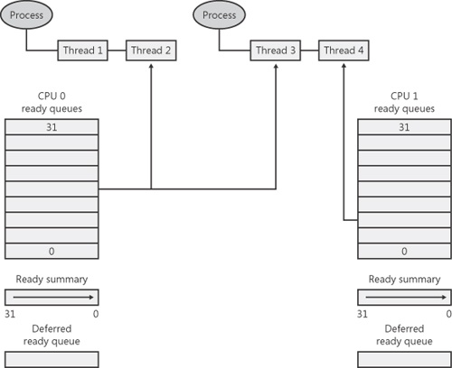
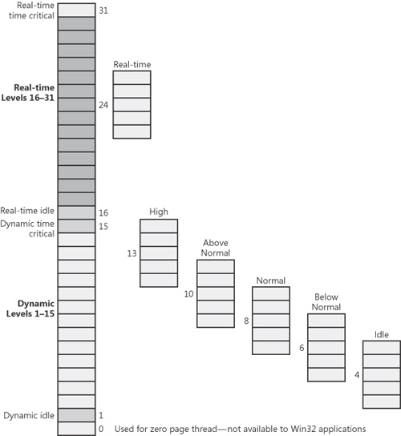
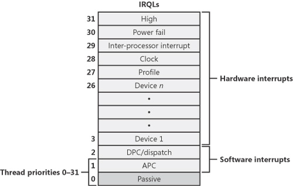
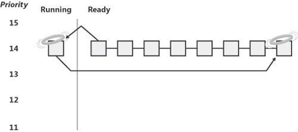
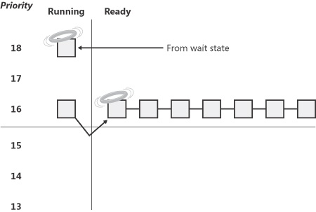
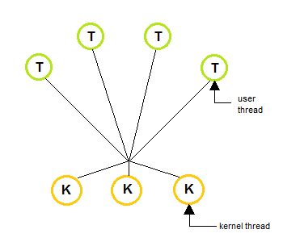

# <!--fit--> PV281: Programování v Rustu

---

# Obsah

1. Plánování procesů
2. Paralelismus v Rustu
3. Úvod do async
4. Perftesting

---

# <!--fit--> Paralelismus

---

# Proces

Každý proces má vlastní paměťový prostor,
tj. vlastní _stack_ a vlastní _heap_.

Přepínaní kontextu je drahé.

Komunikace mezi procesy je pomalejší
(sdílená paměť, message queue, sockety, ...).

Celkově na zdroje má větší náročnost.

---

# Vlákna

Vlákna sdílí pamět, konkrétně _heap_.

Přepínání kontextu je drahé, ale levnější než u procesů.

Komunikace mezi vlákny je rychlá právě díky sdílené haldě.

Vlákna jsou méně náročná na zdroje systému.

---

### Vlákna


[Operating Systems, Chapter 4: Threads](https://www.cs.uic.edu/~jbell/CourseNotes/OperatingSystems/4_Threads.html)

---

# <!--fit--> Plánování procesů ve Windows

---

### Plánování ve Windows

Thread má **prioritu** v rozsahu 0–31 (31 je nejvyšší)

Vlákno má přidělené časové rámce. Časové rámce jsou poskytovány pomocí **round-robin** algoritmu.

Rámec trvá na klientských Win **2** hodinové cykly, na serverových **12**. Jeden cyklus je na většině x64 systémů asi **15 ms**.

Pokud není žádné vlákno ve vyšší prioritě připraveno běžet, na řadu se dostane priorita nižší.

Pokud běží vlákno s nižší prioritou a najednou je k dispozici s vyšší prioritou, tak nižšímu systém sebere čas.

---



---



---



---

# Přepínání vláken

Při přepínání se napřed uloží kontext vlákna, které končí.

Vlákno se umístí na konec fronty dané priority.

Najde se thread s nejvyšší prioritou, který může běžet.

Ten se vytáhne z fronty, načte se jeho kontext a začne se vykonávat.

---

# Důvody přepnutí

- Je dostupné vlákno s vyšší prioritou.
- Vypršel časový úsek pro běh.
- Vlákno musí na něco čekat a vzdá se svého času.

---



---



---

### Stavy vlákna

`Ready` - plánovač pro běh bere v potaz pouze tato vlákna

`Deferred ready` - vlákna naplánovaná na konkrétním procesoru, ale ještě nezaplánovaná. Existuje kvůli minimalizaci locku na plánovací databázi.

`Standby` - vlákno přípravené na běh na konkrétním procesoru; jakmile to bude možné, tak dojde k přepnutí kontextu. Na jádro je jen jedno standby vlákno. Může být přeskočeno preempcí nebo pokud bude vlákno s vyšší prioritou spustitelné.

`Running Once` - stav při přepnutí kontextu

---

### Stavy vlákna
`Waiting` - vlákno na něco čeká – samo pomocí synchronizačního prostředku, na úrovni systému, na I/O operaci,...

`Gate Waiting` - čeká na gate dispatcher objektu

`Transition` - vlákno by mohlo být ready, ale systém odstránkoval zásobník z paměti, tak se čeká, než ho zase dá zpět do paměti

`Terminated` - vlákno skončilo a může být dealokováno

`Initialized` - interní stav po čerstvém vytvoření vlákna

---


---

# NUMA

Typ víceprocesorového systému s neuniformním přístupem do paměti. Tj. každému procesoru zabere různou dobu se dostat k nějakým částem paměti.

Jádra a pamět jsou seskupena pod uzly. Jsou zájemně propojené sběrnicí s kohenertní cache. Neuniformní jsou proto, že přístup k lokální paměti je mnohem rychlejší.

---

# Nastavení affinity

Nastavení je na úrovní procesu nebo vlákna

Možnosti:
NUMA
SMP - je to jedno, kde to bude běžet

---

# Green Thread

Abysme zvýšili čas, který program pracuje a snížili prostředky potřebné při přepínání, tak můžeme využít green thready.

V programu využíváme vlastní vlákna a plánování nad systémovým. Na jednom systémovém vlákně můžeme přepínat několik vlastních.

Existují modely one-to-one, one-to-many a many-to-many.

---



---

# Práce s thready v Rustu
```rust
use std::thread;
use std::time::Duration;

fn main() {
    thread::spawn(|| {
        for i in 1..10 {
            println!("hi number {} from the spawned thread!", i);
            thread::sleep(Duration::from_millis(1));
        }
    });

    for i in 1..5 {
        println!("hi number {} from the main thread!", i);
        thread::sleep(Duration::from_millis(1));
    }
}
```

---

# Práce s thready v Rustu
```rust
use std::thread;
use std::time::Duration;

fn main() {
    let handle = thread::spawn(|| {
        for i in 1..10 {
            println!("hi number {} from the spawned thread!", i);
            thread::sleep(Duration::from_millis(1));
        }
    });

    for i in 1..5 {
        println!("hi number {} from the main thread!", i);
        thread::sleep(Duration::from_millis(1));
    }

    handle.join().unwrap();
}
```

---

# Přenos dat pomocí kanálů
```rust
use std::sync::mpsc;
use std::thread;

fn main() {
    let (tx, rx) = mpsc::channel();

    thread::spawn(move || {
        let val = String::from("hi");
        tx.send(val).unwrap();
    });

    let received = rx.recv().unwrap();
    println!("Got: {}", received);
}
```

---

# Mutex
```rust
use std::sync::Mutex;

fn main() {
    let m = Mutex::new(5);

    {
        let mut num = m.lock().unwrap();
        *num = 6;
    }

    println!("m = {:?}", m);
}
```

---

# Arc<T>
```rust
use std::sync::{Arc, Mutex};
use std::thread;

fn main() {
    let counter = Arc::new(Mutex::new(0));
    let mut handles = vec![];

    for _ in 0..10 {
        let counter = Arc::clone(&counter);
        let handle = thread::spawn(move || {
            let mut num = counter.lock().unwrap();

            *num += 1;
        });
        handles.push(handle);
    }

    for handle in handles {
        handle.join().unwrap();
    }

    println!("Result: {}", *counter.lock().unwrap());
}
```

---

# RwLock<T>

Umožňuje n čtenářů a jednoho zapisujícího. Mutex to neřeší.
```rust
use std::sync::RwLock;

let lock = RwLock::new(5);

// many reader locks can be held at once
{
    let r1 = lock.read().unwrap();
    let r2 = lock.read().unwrap();
    assert_eq!(*r1, 5);
    assert_eq!(*r2, 5);
} // read locks are dropped at this point

// only one write lock may be held, however
{
    let mut w = lock.write().unwrap();
    *w += 1;
    assert_eq!(*w, 6);
}
```

---

# Bariéra

Zasynchronizuje vlákna tak, aby všehna začala zároveň
```rust
use std::sync::{Arc, Barrier};
use std::thread;

let mut handles = Vec::with_capacity(10);
let barrier = Arc::new(Barrier::new(10));
for _ in 0..10 {
    let c = Arc::clone(&barrier);
    // The same messages will be printed together.
    // You will NOT see any interleaving.
    handles.push(thread::spawn(move|| {
        println!("before wait");
        c.wait();
        println!("after wait");
    }));
}
// Wait for other threads to finish.
for handle in handles {
    handle.join().unwrap();
}
```

---

# Úvod do asynchronního programování

---

# Asynchronní programování

Koncept pro psaní konkurentních programů.
Využívá malého množství OS vláken například pro I/O operace.

V Rustu platí:
Je jedno- i vícevláknový.
Async nic nestojí.
Nemá runtime.

---

# Cargo.toml

```toml
[dependencies]
futures = "0.3"
```

---

# async, .await

```rust
use futures::executor::block_on;

async fn hello_world() {
    println!("hello, world!");
}

fn main() {
    let future = hello_world(); // Nothing is printed
    block_on(future); // `future` is run and "hello, world!" is printed
}
```

---

# async, .await

```rust
// `foo()` returns a type that implements `Future<Output = u8>`.
// `foo().await` will result in a value of type `u8`.
async fn foo() -> u8 { 5 }

fn bar() -> impl Future<Output = u8> {
    // This `async` block results in a type that implements
    // `Future<Output = u8>`.
    async {
        let x: u8 = foo().await;
        x + 5
    }
}
```

---

# Perftesting

---

# Bench atribut

```rust
#![feature(test)]

extern crate test;

pub fn add_two(a: i32) -> i32 {
    a + 2
}

#[cfg(test)]
mod tests {
    use super::*;
    use test::Bencher;

    #[test]
    fn it_works() {
        assert_eq!(4, add_two(2));
    }

    #[bench]
    fn bench_add_two(b: &mut Bencher) {
        b.iter(|| add_two(2));
    }
}
```

---

# Spuštění testu

```
cargo bench
```

```
$ cargo bench
   Compiling adder v0.0.1 (file:///home/user/tmp/adder)
     Running target/release/adder-91b3e234d4ed382a

running 2 tests
test tests::it_works ... ignored
test tests::bench_add_two ... bench:         1 ns/iter (+/- 0)

test result: ok. 0 passed; 0 failed; 1 ignored; 1 measured
```

---

# Optimalizace a benchmarking

Optimalizer vypustí část kódu, kterou pokládá za zbytečnou.

```rust
#![feature(test)]

extern crate test;
use test::Bencher;

#[bench]
fn bench_xor_1000_ints(b: &mut Bencher) {
    b.iter(|| {
        (0..1000).fold(0, |old, new| old ^ new); // <- řešením je vrátit hodnotu. Tj odstranit ;
    });
}
```

---

# Blackbox

```rust
#![feature(test)]

extern crate test;

b.iter(|| {
    let n = test::black_box(1000);

    (0..n).fold(0, |a, b| a ^ b)
})
```

---

# Crate criterion

```toml
[dev-dependencies]
criterion = "0.3"

[[bench]]
name = "my_benchmark"
harness = false
```

---

# Crate criterion

Vytvořete soubor v `/benches/bench_name.rs`.

```rust
use criterion::{black_box, criterion_group, criterion_main, Criterion};

fn fibonacci(n: u64) -> u64 {
    match n {
        0 => 1,
        1 => 1,
        n => fibonacci(n-1) + fibonacci(n-2),
    }
}

fn criterion_benchmark(c: &mut Criterion) {
    c.bench_function("fib 20", |b| b.iter(|| fibonacci(black_box(20))));
}

criterion_group!(benches, criterion_benchmark);
criterion_main!(benches);
```

---

# <!--fit--> Dotazy?

---

# <!--fit--> Děkuji za pozornost

