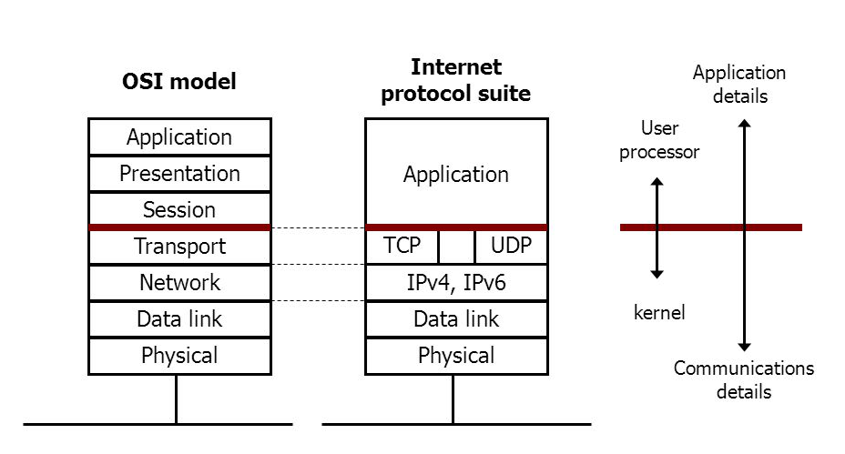

# <!--fit--> PV281: Programování v Rustu

---

# Obsah

1. Tokio
2. Serde
3. Network Programming


---

# Asynchronní programování

Pro zopakování: při běžné blokující I/O operaci systém preemptivně sebere vláknu čas, protože čeká na dokončení operace. S asynchronních programováním jsou operace, které není možné ihned dokončit přesunuty do pozadí a mezitím se vykonává jiné kód.

Takovým blokům kódu se říká tasky. Ty jsou běžně reprezentovány green thready.

---

# Tokio

Je nejpoužívanější asynchronní runtime pro Rust. Umožnuje asynchronní operace nad I/O a zjednodušuje síťové programování. (TCP, UDP, Unix sockety, dále timers, synchronizaci, různé plánovače, aj.)

Standardní knihovna v Rustu poskytuje rozhraní pro asynchronní programování, ale neposkytuje implementované funkce. Proto je potřeba zvolit některou z komunitních implementací. 

Výhodou je výkon, spolehlivost, odzkoušenost a flexibilita.

---

# K čemu nepoužívat Tokio

## Paralení výpočty
Tokio je určené pro scénáře, kdy jednotlivé úlohy čekají na IO. Pokud potřebujete paralelizovat výpočty, můžete využít rayon nebo sami pracovat s thready. Rayon a Tokio můžete mixovat dohromady.

## Single request
Pokud potřebujete poslat jeden požadavek a nemusíte jich paralelizovat několik současně, tak je otázka, jestli se vyplatí práce navíc s využítím Tokia a není lepší použít blokující volání. Nebude mezi nimi výkonostně rozdíl.

---

# Tokio dependency

```toml
tokio = { version = "1", features = ["full"] }

```

---

# Použití Tokio

```rust
async fn say_world() {
    println!("world");
}

#[tokio::main]
async fn main() {
    // `say_world()` se ihned nespoustí. Async funkce jsou lazy.
    let op = say_world();

    println!("hello");

    // Await `.await` na `op` provede `say_world` a počká na výsledek.
    op.await;
}
```

---

# Makro tokio::main

```rust
#[tokio::main]
async fn main() {
    println!("hello");
}
```

se překonvertuje na

```rust
fn main() {
    let mut rt = tokio::runtime::Runtime::new().unwrap();
    rt.block_on(async {
        println!("hello");
    })
}
```

---


---


---

# Práce se soubory

Práce se soubory je paralelní, ale není skutečeně asynronní na úrovni OS. Tokio spustí souborové operace jako blokující v samostatných vláknech.

Pozn. neblokující operace v crate tokio_uring

---

# Čtení ze souboru
```rust
use tokio::io::{self, AsyncReadExt};
use tokio::fs::File;

#[tokio::main]
async fn main() -> io::Result<()> {
    let mut f = File::open("foo.txt").await?;
    let mut buffer = Vec::new();

    // read the whole file
    f.read_to_end(&mut buffer).await?;
    Ok(())
}
```

---

# Zápis do souboru
```rust
use tokio::io::{self, AsyncWriteExt};
use tokio::fs::File;

#[tokio::main]
async fn main() -> io::Result<()> {
    let mut buffer = File::create("foo.txt").await?;

    buffer.write_all(b"some bytes").await?;
    Ok(())
}
```

---

# Použití TCP socketu

```rust
use tokio::io::{self, AsyncReadExt, AsyncWriteExt};
use tokio::net::TcpListener;

#[tokio::main]
async fn main() -> io::Result<()> {
    let mut listener = TcpListener::bind("127.0.0.1:6142").await.unwrap();

    loop {
        let (mut socket, _) = listener.accept().await?;

        tokio::spawn(async move {
            let mut buf = vec![0; 1024];

            loop {
                match socket.read(&mut buf).await {
                    // Return value of `Ok(0)` signifies that the remote has
                    // closed
                    Ok(0) => return,
                    Ok(n) => {
                        if socket.write_all(&buf[..n]).await.is_err() {
                            return;
                        }
                    }
                    Err(_) => {
                        return;
                    }
                }
            }
        });
    }
}
```

---

# Asynchronní mutex

```rust
use tokio::sync::Mutex; // note! This uses the Tokio mutex

// This compiles!
// (but restructuring the code would be better in this case)
async fn increment_and_do_stuff(mutex: &Mutex<i32>) {
    let mut lock = mutex.lock().await;
    *lock += 1;

    do_something_async().await;
} // lock goes out of scope here
```

---

# Problémy asynchronní synchronizace

Synchronizace je drahá. Proto se snažíme kód psát tak, aby byl nezávislý a nebylo třeba ho synchronizovat.

Pokud je třeba rychlejší implementace mutexu (nebo například podpora pro Windows XP), tak existuje crate parking_lot.
https://crates.io/crates/parking_lot

---

# Message passing

mpsc:      multi-producer, single-consumer channel.
oneshot:   single-producer, single consumer channel. 
broadcast: multi-producer, multi-consumer. 
watch:     single-producer, multi-consumer. 
 
---

# Ukázkové implementace

---

# Struktura Command

```rust
use bytes::Bytes;

#[derive(Debug)]
enum Command {
    Get {
        key: String,
    },
    Set {
        key: String,
        val: Bytes,
    }
}
```

---

# MPSC

```rust
use tokio::sync::mpsc;

#[tokio::main]
async fn main() {
    // Create a new channel with a capacity of at most 32.
    let (tx, mut rx) = mpsc::channel(32);

    let tx2 = tx.clone();

    tokio::spawn(async move {
        tx.send("sending from first handle").await;
    });

    tokio::spawn(async move {
        tx2.send("sending from second handle").await;
    });

    while let Some(message) = rx.recv().await {
        println!("GOT = {}", message);
    }
}
```

---

# Stream

Jedná se o asynchronní variantu k iterátorům. Bohužel zatím nejdou použít ve for cyklu a musíme použít while let.

Místo funkce into_iter() používáme její asynchronní obdobu into_stream().

Po použití potřebujeme crate tokio-stream. Streamy zatím nejsou standardizované v std. Ale neočekává se změna oproti tomu, co se tady naučíme.

---

# Zpracování streamu

```rust
use tokio_stream::StreamExt;

#[tokio::main]
async fn main() {
    let mut stream = tokio_stream::iter(&[1, 2, 3]);

    while let Some(v) = stream.next().await {
        println!("GOT = {:?}", v);
    }
}
```

---

# into_stream()

```rust
use tokio_stream::StreamExt;
use mini_redis::client;

async fn publish() -> mini_redis::Result<()> {
    let mut client = client::connect("127.0.0.1:6379").await?;

    client.publish("numbers", "1".into()).await?;
    client.publish("numbers", "two".into()).await?;
    client.publish("numbers", "3".into()).await?;
    Ok(())
}

async fn subscribe() -> mini_redis::Result<()> {
    let client = client::connect("127.0.0.1:6379").await?;
    let subscriber = client.subscribe(vec!["numbers".to_string()]).await?;
    let messages = subscriber.into_stream();

    tokio::pin!(messages);

    while let Some(msg) = messages.next().await {
        println!("got = {:?}", msg);
    }

    Ok(())
}
```

---

# Serializace

Převedení struktury nebo jiné reprezentace na textovou/binární/jinou. V některých jazycích se jí říká marshaling.

Je to naprosto běžná úloha, kterou dneska potřebujete ve všech programech, ať už na převod do JSONu nebo jiného formátu, který používáme ke komunikaci.

Obrácený proces je deserializace. Příkladem může být načtení JSON konfigurace ze souboru do struktury.

---

# Serde

V tuto chvíli nejpouživánější knihovna pro serialiazi dostupná v Rustu. Nemusí být vždy nejrychlejší, ale je odzkoušená a dobře dokumentovaná.

Hlavní část dostupná v crate serde. Jednotlivé formáty dostupné v samostatných crate - např. serde_json.

Primárně se spoléhá na atributová makra.

---

# Závislost 

```toml
[package]
name = "my-crate"
version = "0.1.0"
authors = ["Me <user@rust-lang.org>"]

[dependencies]
serde = { version = "1.0", features = ["derive"] }

# serde_json is just for the example, not required in general
serde_json = "1.0"
```

---

# Serializace a deserializace

```rust
use serde::{Serialize, Deserialize};

#[derive(Serialize, Deserialize, Debug)]
struct Point {
    x: i32,
    y: i32,
}

fn main() {
    let point = Point { x: 1, y: 2 };

    let serialized = serde_json::to_string(&point).unwrap();
    println!("serialized = {}", serialized);

    let deserialized: Point = serde_json::from_str(&serialized).unwrap();
    println!("deserialized = {:?}", deserialized);
}
```

---

# cammelCase fieldy

```rust
#[derive(Serialize)]
#[serde(rename_all = "camelCase")]
struct Person {
    first_name: String,
    last_name: String,
}
```

---

# Reprezentace enum jako čísla

```rust
use serde_repr::*;

#[derive(Serialize_repr, Deserialize_repr, PartialEq, Debug)]
#[repr(u8)]
enum SmallPrime {
    Two = 2,
    Three = 3,
    Five = 5,
    Seven = 7,
}
```

---

# Default hodnoty

```rust
#[derive(Deserialize, Debug)]
struct Request {
    // Use the result of a function as the default if "resource" is
    // not included in the input.
    #[serde(default = "default_resource")]
    resource: String,

    // Use the type's implementation of std::default::Default if
    // "timeout" is not included in the input.
    #[serde(default)]
    timeout: Timeout,

    // Use a method from the type as the default if "priority" is not
    // included in the input. This may also be a trait method.
    #[serde(default = "Priority::lowest")]
    priority: Priority,
}
```

---

# flattening

```rust
#[derive(Serialize, Deserialize)]
struct Pagination {
    limit: u64,
    offset: u64,
    total: u64,
}

#[derive(Serialize, Deserialize)]
struct Users {
    users: Vec<User>,

    #[serde(flatten)]
    pagination: Pagination,
}
``` 

---

# skip

```rust
use serde::Serialize;

use std::collections::BTreeMap as Map;

#[derive(Serialize)]
struct Resource {
    // Always serialized.
    name: String,

    // Never serialized.
    // NOTE: IT WILL TRY TO DESERIALIZE, USE skip_deserializing ALSO OR DEFAULT
    #[serde(skip_serializing)]
    hash: String,

    // Use a method to decide whether the field should be skipped.
    #[serde(skip_serializing_if = "Map::is_empty")]
    metadata: Map<String, String>,
}
```

---

# <!--fit--> Síťové programování

---

OSI a TCP/IP




---

# Adresování 

## PC
Počítač adresujeme pomocí IP adresy. Ta samotná nám pro socketovou komunikaci stačí. Pro veřejné služby chceme použít místo konkrétní IP doménové jméno. Takže potřebujeme A záznam na DNS. Pro synonyma využijeme CNAME. Často je potřeba vytvořit i PTR záznam (třeba kvůli mailu)

## Aplikace
Aplikace má přidělené číslo portu.

---

# Důležité IP adresy

127.0.0.1 - local loopback

Privátní adresy
A: 10.0.0.0 — 10.255.255.255
B: 172.16.0.0 — 172.31.255.255 
C: 192.168.0.0 — 192.168.255.255

Fallback
169.254.0.0 - 169.254.255.255

---

# Porty
0 - 1023: well-known porty. Bindnout je může pouze root.
1024 - 49151: registrované porty. Některé z nich jsou vázané na konkrétní služby.
49152 - 65535: dynamické nebo taky privátní porty.

---

# UDP komunikace

Získání socketu a provázání s portem: bind
Komunikace one to many (strana serveru): recv_from, send_to
Komunikace one to one (strana klienta): recv, send

---

# UDP server

```rust
use tokio::net::UdpSocket;
use std::io;

#[tokio::main]
async fn main() -> io::Result<()> {
    let sock = UdpSocket::bind("0.0.0.0:8080").await?;
    let mut buf = [0; 1024];
    loop {
        let (len, addr) = sock.recv_from(&mut buf).await?;
        println!("{:?} bytes received from {:?}", len, addr);

        let len = sock.send_to(&buf[..len], addr).await?;
        println!("{:?} bytes sent", len);
    }
}
```

---

# UDP client

```rust
use tokio::net::UdpSocket;
use std::io;

#[tokio::main]
async fn main() -> io::Result<()> {
    let sock = UdpSocket::bind("0.0.0.0:0").await?;

    let remote_addr = "127.0.0.1:8080";
    sock.connect(remote_addr).await?;
    let mut buf = [0; 1024];
    loop {
        let len = sock.recv(&mut buf).await?;
        println!("{:?} bytes received from {:?}", len, remote_addr);

        let len = sock.send(&buf[..len]).await?;
        println!("{:?} bytes sent", len);
    }
}
```

---

# TCP komunikace

Strana serveru: TcpListener
Pomocí bind naváže číslo portu. Pomocí accept přijme připojení.

Strana klienta: TcpSocket

Komunikace pomocí TcpStream

---

# TcpListener

```rust
use tokio::net::TcpListener;

use std::io;

async fn process_socket<T>(socket: T) {
    // do work with socket here
}

#[tokio::main]
async fn main() -> io::Result<()> {
    let listener = TcpListener::bind("127.0.0.1:8080").await?;

    loop {
        let (socket, _) = listener.accept().await?;
        process_socket(socket).await;
    }
}
```

---

# TCP socket

```rust
use tokio::net::TcpSocket;

use std::io;

#[tokio::main]
async fn main() -> io::Result<()> {
    let addr = "127.0.0.1:8080".parse().unwrap();

    let socket = TcpSocket::new_v4()?;
    let stream = socket.connect(addr).await?;

    Ok(())
}
```

---

# TcpStream

```rust
use tokio::net::TcpStream;
use tokio::io::AsyncWriteExt;
use std::error::Error;

#[tokio::main]
async fn main() -> Result<(), Box<dyn Error>> {
    // Connect to a peer
    let mut stream = TcpStream::connect("127.0.0.1:8080").await?;

    // Write some data.
    stream.write_all(b"hello world!").await?;

    Ok(())
}
```

---

# Read a write

```rust
use std::io::prelude::*;
use std::net::TcpStream;

fn main() -> std::io::Result<()> {
    let mut stream = TcpStream::connect("127.0.0.1:34254")?;

    stream.write(&[1])?;
    stream.read(&mut [0; 128])?;
    Ok(())
} // the stream is closed here
```


---

# Čtení ze streamu

```rust
use tokio::io::Interest;
use tokio::net::TcpStream;
use std::error::Error;
use std::io;

#[tokio::main]
async fn main() -> Result<(), Box<dyn Error>> {
    let stream = TcpStream::connect("127.0.0.1:8080").await?;

    loop {
        let ready = stream.ready(Interest::READABLE | Interest::WRITABLE).await?;

        if ready.is_readable() {
            let mut data = vec![0; 1024];
            // Try to read data, this may still fail with `WouldBlock`
            // if the readiness event is a false positive.
            match stream.try_read(&mut data) {
                Ok(n) => {
                    println!("read {} bytes", n);        
                }
                Err(ref e) if e.kind() == io::ErrorKind::WouldBlock => {
                    continue;
                }
                Err(e) => {
                    return Err(e.into());
                }
            }

        }
    }
}
```

---

# Čtení ze streamu

```rust
use tokio::io::Interest;
use tokio::net::TcpStream;
use std::error::Error;
use std::io;

#[tokio::main]
async fn main() -> Result<(), Box<dyn Error>> {
    let stream = TcpStream::connect("127.0.0.1:8080").await?;

    loop {
        let ready = stream.ready(Interest::READABLE | Interest::WRITABLE).await?;

        if ready.is_writable() {
            // Try to write data, this may still fail with `WouldBlock`
            // if the readiness event is a false positive.
            match stream.try_write(b"hello world") {
                Ok(n) => {
                    println!("write {} bytes", n);
                }
                Err(ref e) if e.kind() == io::ErrorKind::WouldBlock => {
                    continue
                }
                Err(e) => {
                    return Err(e.into());
                }
            }
        }
    }
}
```

---

# <!--fit--> Dotazy?

---

# <!--fit--> Děkuji za pozornost

