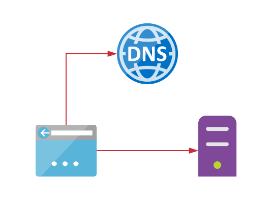
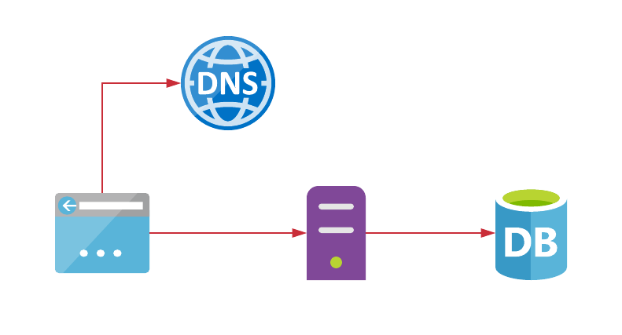
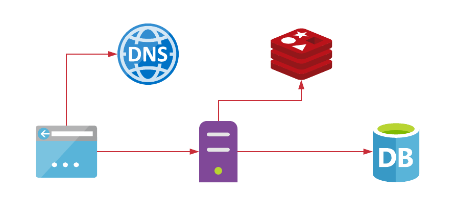
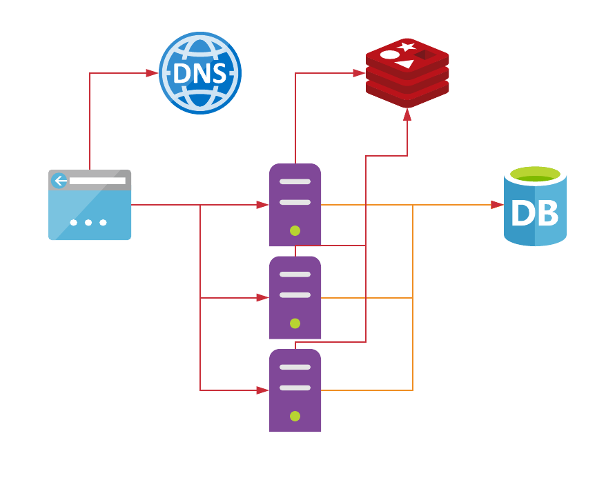
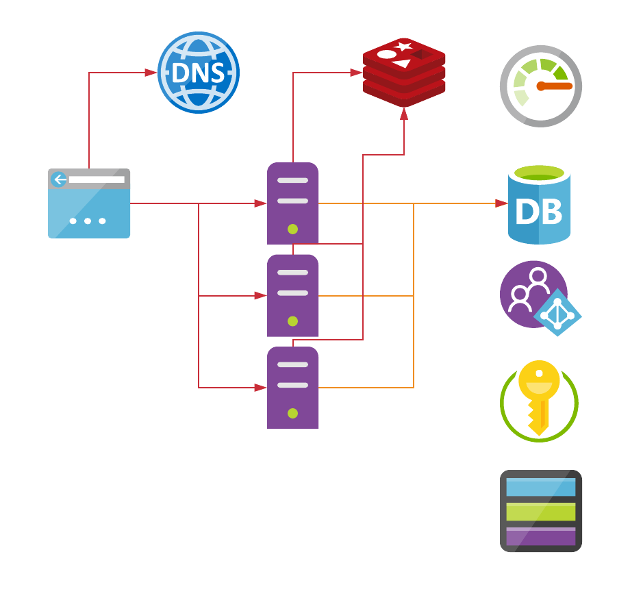
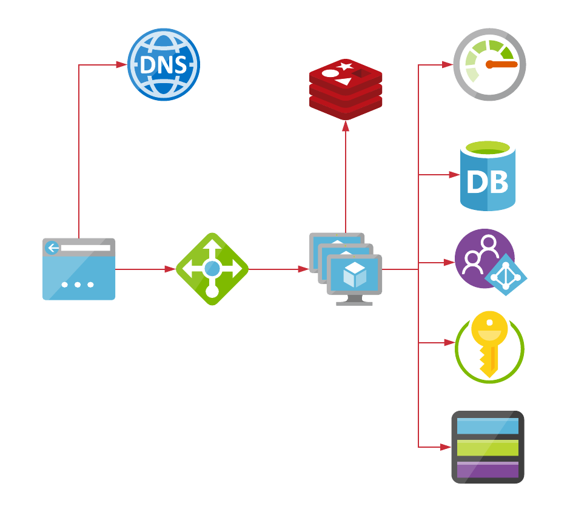
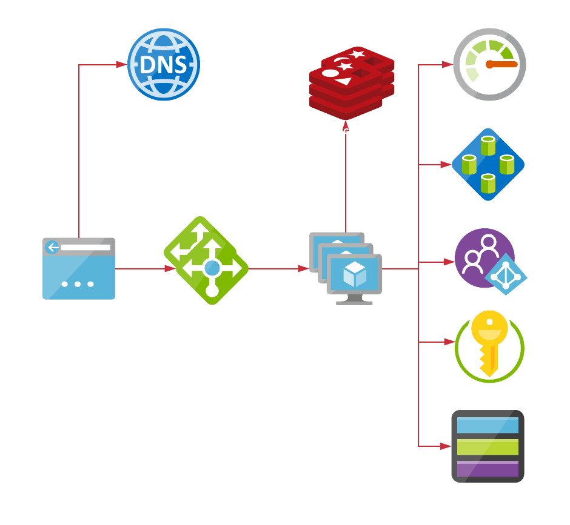
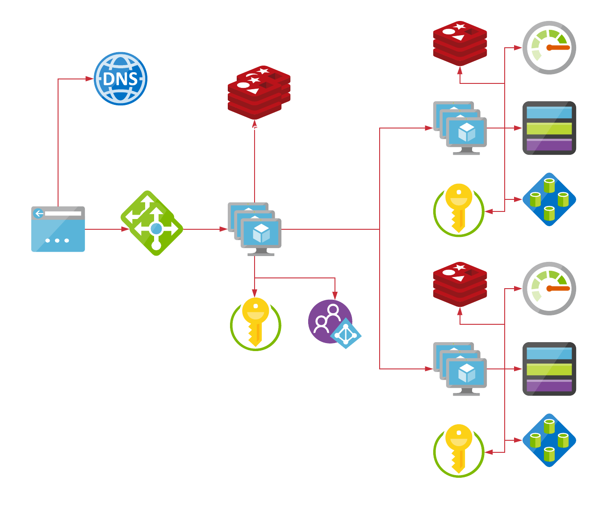
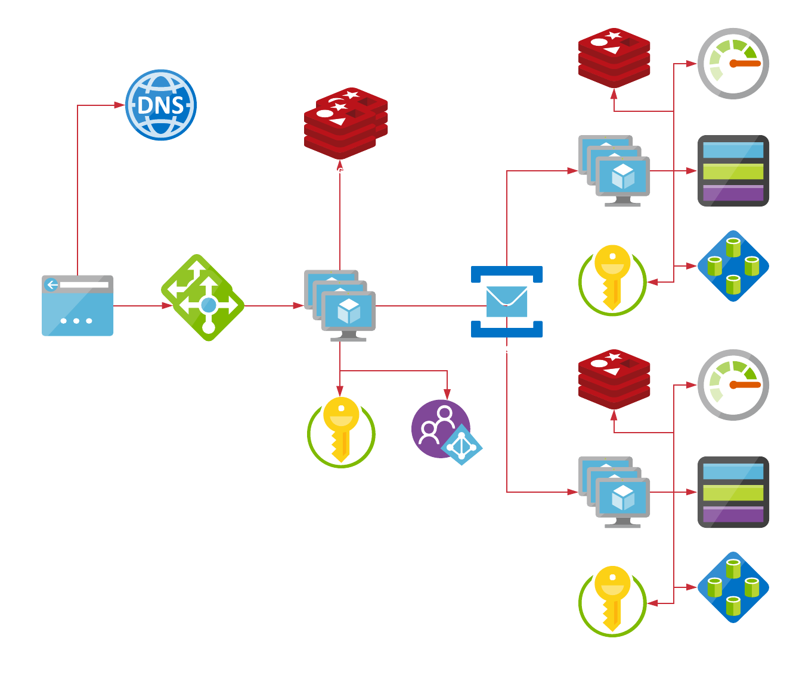

# <!--fit--> PV281: Programování v Rustu

---

# Obsah

1. Architektury webových aplikací
2. Actix
3. Šablony
4. REST API
5. Debugging REST API
6. Logování
7. CORS
8. Autentizace

---

# <!--fit--> Webové aplikace

---

# HTTP protokol

Představuje komunikaci mezi serverem a klientem. Dříve šlo o textový protokol nad TCP. Ve verzi 2 se z něj stal binární protokol. Ve verzi 3 vznikl protokol QUIC (Quick UDP Internet Connections), který vyžívá více multiplexových UDP spojení.

Pro jednoduchost se budeme bavit o HTTP1. 

```http
GET / HTTP/1.1
Host: www.example.com
```

Zpráva obsahuje metodu, lokaci, verzi protokolu a hostname na který jdeme.

---

# Příklady HTTP requestů

```http
GET styles.css HTTP/1.1

GET /api/tasks HTTP/1.1

GET /page.html HTTP/1.1
```

---

# HTTP odpověď

```http
HTTP/1.1 200 OK
Date: Mon, 23 May 2005 22:38:34 GMT
Content-Type: text/html; charset=UTF-8
Content-Length: 138
Last-Modified: Wed, 08 Jan 2003 23:11:55 GMT
Server: Apache/1.3.3.7 (Unix) (Red-Hat/Linux)
ETag: "3f80f-1b6-3e1cb03b"
Accept-Ranges: bytes
Connection: close

<html>
  <head>
    <title>An Example Page</title>
  </head>
  <body>
    <p>Hello World, this is a very simple HTML document.</p>
  </body>
</html>
```

---

# HTTP metody

```
     |- GET     -|
safe-|- HEAD    -|
     |- OPTION  -|-idempotentní
        PUT     -|
        DELETE  -|
        POST  -neidempotentní     

```

---

# Stavové kódy

```
200   OK                              vracím data
204   No Content                      něco se stalo; bylo to ok, ale nevracím obsah
301   Moved Permanently               vždy přesměrovat na novou URL
400   Bad Request                     špatné typy, rozsahy, apod
401   Unauthorized                    je potřeba se přihlásit
403   Forbidden                       přihlášený nemá přístup
404   Not Found                       stránka neexistuje
500   Internal Server Error           nějaká chyba u nás

```

---

# HTTP2

- binární protokolu
- šifrovaný pomocí TLS v základu
- přes jedno spojení jde pushnout více věcí

---

# Websockets

- obousměrná binární komunikace
- vhodné pro realtime systémy
- spojení nemusí být šifrované

---



---



---



---



---



---



---



---



---



---

# Actor Pattern

Jedná se o jeden ze způsobů, jak vytvářet paralelní systémy. Tento vzor se ukázal jako vysoce efektivní (například pohání Halo servery). V rámci systému máme actora, který představuje konkurentní výpočet. Actor má svoji svoji adresu, na které přijímá zprávy. Zpráva představuje volání actora (může to být volání jeho funkce nebo zpráva v message bus systému). Tím se spustí samotné vykonání. Actor si drží svůj vlastní stav, nemůže ovlivnit stav ostatních. Actor může vytvořit další actory, případně zaslat ostatním zprávy (což omezuje potřebu zamykání).

---

# Actix

Jde o extrémně rychlý webový framework (actix-web), dříve postavený na actor patternu (actix). Dnes využívá uvnitř tokio. 

---

# Závislosti

```toml
[dependencies]
actix-web = "3"
```

---

# Vytvoření aplikace

```rust
use actix_web::{get, post, web, App, HttpResponse, HttpServer, Responder};

#[get("/")]
async fn hello() -> impl Responder {
    HttpResponse::Ok().body("Hello world!")
}

#[post("/echo")]
async fn echo(req_body: String) -> impl Responder {
    HttpResponse::Ok().body(req_body)
}

async fn manual_hello() -> impl Responder {
    HttpResponse::Ok().body("Hey there!")
}
```

---

# Spuštění

```sh
cargo watch -x 'run --bin app'
```

---

# Šablony přes Askama

Jeden ze šablonovacích enginů. Šablony jsou kompilované s typovou kontrolou.

```
[dependencies]
actix-web = "3"
askama = "0.9"

[build-dependencies]
askama = "0.9"
```

---

# Rust část

```rust
use std::collections::HashMap;

use actix_web::{web, App, HttpResponse, HttpServer, Result};
use askama::Template;

#[derive(Template)]
#[template(path = "user.html")]
struct UserTemplate<'a> {
    name: &'a str,
    text: &'a str,
}

#[derive(Template)]
#[template(path = "index.html")]
struct Index;

async fn index(query: web::Query<HashMap<String, String>>) -> Result<HttpResponse> {
    let s = if let Some(name) = query.get("name") {
        UserTemplate {
            name,
            text: "Welcome!",
        }
        .render()
        .unwrap()
    } else {
        Index.render().unwrap()
    };
    Ok(HttpResponse::Ok().content_type("text/html").body(s))
}

#[actix_web::main]
async fn main() -> std::io::Result<()> {
    HttpServer::new(move || {
        App::new().service(web::resource("/").route(web::get().to(index)))
    })
    .bind("127.0.0.1:8080")?
    .run()
    .await
}
```

---

# HTML šablona index.html

```html
<!DOCTYPE html>
<html>
<head>
  <meta charset="utf-8" />
  <title>Actix web</title>
</head>
<body>
  <h1>My best website!</h1>
  <p>Welcome, traveler.</p>
</body>
</html>
```

---

# HTML šablona user.html

```html
<!DOCTYPE html>
<html>
<head>
  <meta charset="utf-8" />
  <title>Actix web</title>
</head>
<body>
  <h1>Hi, {{ name }}!</h1>
  <p>
    {{ text }}
  </p>
</body>
</html>
```

---

# Zpracování formu

```rust
use actix_web::{post, web, HttpResponse};
use serde::Deserialize;

#[derive(Deserialize)]
struct FormData {
    username: String,
}

#[post("/")]
async fn index(form: web::Form<FormData>) -> HttpResponse {
    HttpResponse::Ok().body(
    	format!("username: {}", form.username)
    )
}
```

---

# REST API

- základní způsob jak dnes budujeme rozhraní backendové aplikace
- primárně využívá JSON (ale jde použít i XML)
- rozhraní vychází z domény (puristické) a nebo z požadavků prezentační vrstvy (agregované)

---

# JSON

```json
{
    "teams": [
        {
            "name": "Seven Deadly Sins",
            "heroes": [
                {
                    "name": "Meliodas",
                    "powerLevel": 60000,
                    "race": "Demon"
                },
                {
                    "name": "Elizabeth",
                    "powerLevel": 60000,
                    "race": "Goddess"
                },
                {
                    "name": "Bane",
                    "powerLevel": 30000,
                    "race": "Human"
                }
            ]
        }
    ]
}
```

---

# Pojmenování endpointů

## List nebo vytvoření
```
​/devices
/configurations
```

## Operace nad jedním záznamem
```
/devices/{id}
/configurations/{id}
```

## Vazby
```
/devices/{id}/configurations
/devices/{id}/configurations/{id}
```
---

# <!--fit--> Pro pojmenování endpointu používáme jen podstatná jména,
# <!--fit--> nikdy nepoužíváme slovesa!

---

# Takto ne

```
GET /getAllEmployees
GET /getEmployeeWithId
POST /createEmployee
```

---

# JSON v requestu

```rust
use actix_web::{web, App, HttpServer, Result};
use serde::Deserialize;

#[derive(Deserialize)]
struct Info {
    username: String,
}

/// extract `Info` using serde
async fn index(info: web::Json<Info>) -> Result<String> {
    Ok(format!("Welcome {}!", info.username))
}

#[actix_web::main]
async fn main() -> std::io::Result<()> {
    HttpServer::new(
    	|| App::new().route("/", web::post().to(index)))
        .bind("127.0.0.1:8080")?
        .run()
        .await
}
```

---

# JSON response

```rust
use actix_web::{get, web, HttpResponse, Result};
use serde::{Deserialize, Serialize};

#[derive(Serialize, Deserialize)]
struct MyObj {
    name: String,
}

#[get("/a/{name}")]
async fn index(obj: web::Path<MyObj>) -> Result<HttpResponse> {
    Ok(HttpResponse::Ok().json(MyObj {
        name: obj.name.to_string(),
    }))
}

#[actix_web::main]
async fn main() -> std::io::Result<()> {
    // as usual
}
```

---

# Logování

```rust
use actix_web::middleware::Logger;
use env_logger::Env;

#[actix_web::main]
async fn main() -> std::io::Result<()> {
    use actix_web::{App, HttpServer};

    env_logger::from_env(Env::default().default_filter_or("info")).init();

    HttpServer::new(|| {
        App::new()
            .wrap(Logger::default())
            .wrap(Logger::new("%a %{User-Agent}i"))
    })
    .bind("127.0.0.1:8080")?
    .run()
    .await
}
```

---

# OpenTelemetry

Otevřený standard pro telemetrii napříč různými systémy - ať už cloud nebo vlastní infrastruktura. Pro OpenTelemetry jsou knihovny ve všech důležitých jazycích.

Můžeme použít:
Jaeger
Prometheus
Datadog
Azure Application Insights 
Google Cloud Trace
AWS X-Ray
a jiné

---

# OpenTelemetry v Rustu

```rust
use opentelemetry::{global, sdk::export::trace::stdout, trace::Tracer};

fn main() {
    // Create a new trace pipeline that prints to stdout
    let tracer = stdout::new_pipeline().install_simple();

    tracer.in_span("doing_work", |cx| {
        // Traced app logic here...
    });

    // Shutdown trace pipeline
    global::shutdown_tracer_provider();
}
```

---

# OpenTelemetry pro Datadog

```rust
use opentelemetry::global;
use opentelemetry::global::shutdown_tracer_provider;
use opentelemetry::{
    trace::{Span, TraceContextExt, Tracer},
    Key,
};
use opentelemetry_datadog::{new_pipeline, ApiVersion};
use std::thread;
use std::time::Duration;

fn bar() {
    let tracer = global::tracer("component-bar");
    let mut span = tracer.start("bar");
    span.set_attribute(Key::new("span.type").string("sql"));
    span.set_attribute(Key::new("sql.query").string("SELECT * FROM table"));
    thread::sleep(Duration::from_millis(6));
    span.end()
}

fn main() -> Result<(), Box<dyn std::error::Error + Send + Sync + 'static>> {
    let tracer = new_pipeline()
        .with_service_name("trace-demo")
        .with_version(ApiVersion::Version05)
        .install_simple()?;

    tracer.in_span("foo", |cx| {
        let span = cx.span();
        span.set_attribute(Key::new("span.type").string("web"));
        span.set_attribute(Key::new("http.url").string("http://localhost:8080/foo"));
        span.set_attribute(Key::new("http.method").string("GET"));
        span.set_attribute(Key::new("http.status_code").i64(200));

        thread::sleep(Duration::from_millis(6));
        bar();
        thread::sleep(Duration::from_millis(6));
    });

    shutdown_tracer_provider();

    Ok(())
}
```

---

# Integrace pro Actix

```rust
use actix_service::Service;
use actix_web::middleware::Logger;
use actix_web::{web, App, HttpServer};
use opentelemetry::trace::TraceError;
use opentelemetry::{global, sdk::trace as sdktrace};
use opentelemetry::{
    trace::{FutureExt, TraceContextExt, Tracer},
    Key,
};

fn init_tracer() -> Result<sdktrace::Tracer, TraceError> {
    opentelemetry_jaeger::new_pipeline() // nahradte libovolnym systemem
        .with_collector_endpoint("http://127.0.0.1:14268/api/traces")
        .with_service_name("trace-http-demo")
        .install_batch(opentelemetry::runtime::Tokio)
}

async fn index() -> &'static str {
    let tracer = global::tracer("request");
    tracer.in_span("index", |ctx| {
        ctx.span().set_attribute(Key::new("parameter").i64(10));
        "Index"
    })
}

#[actix_web::main]
async fn main() -> std::io::Result<()> {
    std::env::set_var("RUST_LOG", "debug");
    env_logger::init();
    let tracer = init_tracer().expect("Failed to initialise tracer.");

    HttpServer::new(move || {
        let tracer = tracer.clone();
        App::new()
            .wrap(Logger::default())
            .wrap_fn(move |req, srv| {
                tracer.in_span("middleware", move |cx| {
                    cx.span()
                        .set_attribute(Key::new("path").string(req.path().to_string()));
                    srv.call(req).with_context(cx)
                })
            })
            .route("/", web::get().to(index))
    })
    .bind("127.0.0.1:8088")
    .unwrap()
    .run()
    .await
}
```

---

# Tracing 

```rust
use opentelemetry::exporter::trace::stdout;
use tracing::{error, span};
use tracing_subscriber::layer::SubscriberExt;
use tracing_subscriber::Registry;

fn main() {
    // Install a new OpenTelemetry trace pipeline
    let (tracer, _uninstall) = stdout::new_pipeline().install();

    // Create a tracing layer with the configured tracer
    let telemetry = tracing_opentelemetry::layer().with_tracer(tracer);

    // Use the tracing subscriber `Registry`, or any other subscriber
    // that impls `LookupSpan`
    let subscriber = Registry::default().with(telemetry);

    // Trace executed code
    tracing::subscriber::with_default(subscriber, || {
        // Spans will be sent to the configured OpenTelemetry exporter
        let root = span!(tracing::Level::TRACE, "app_start", work_units = 2);
        let _enter = root.enter();

        error!("This event will be logged in the root span.");
    });
}
```

---

# Tracing pro Actix

```rust
use actix_web::middleware::Logger;
use actix_web::App;
use tracing::{Subscriber, subscriber::set_global_default};
use tracing_actix_web::TracingLogger;
use tracing_bunyan_formatter::{BunyanFormattingLayer, JsonStorageLayer};
use tracing_subscriber::{layer::SubscriberExt, EnvFilter, Registry};

/// Compose multiple layers into a `tracing`'s subscriber.
pub fn get_subscriber(
    name: String,
    env_filter: String
) -> impl Subscriber + Send + Sync {
    let env_filter = EnvFilter::try_from_default_env()
        .unwrap_or(EnvFilter::new(env_filter));
    let formatting_layer = BunyanFormattingLayer::new(
        name.into(),
        std::io::stdout
    );
    Registry::default()
        .with(env_filter)
        .with(JsonStorageLayer)
        .with(formatting_layer)
}

/// Register a subscriber as global default to process span data.
///
/// It should only be called once!
pub fn init_subscriber(subscriber: impl Subscriber + Send + Sync) {
    LogTracer::init().expect("Failed to set logger");
    set_global_default(subscriber).expect("Failed to set subscriber");
}

fn main() {
    let subscriber = get_subscriber("app".into(), "info".into());
    init_subscriber(subscriber);

    let app = App::new().wrap(TracingLogger);
}
```

---
# SSL/TLS přes rustls

```rust
use std::fs::File;
use std::io::BufReader;

use actix_files::Files;
use actix_web::{middleware, web, App, HttpRequest, HttpResponse, HttpServer};
use rustls::internal::pemfile::{certs, pkcs8_private_keys};
use rustls::{NoClientAuth, ServerConfig};

/// simple handle
async fn index(req: HttpRequest) -> HttpResponse {
    println!("{:?}", req);
    HttpResponse::Ok()
        .content_type("text/html; charset=utf-8")
        .body("<!DOCTYPE html><html><body><p>Welcome!</p></body></html>")
}

#[actix_web::main]
async fn main() -> std::io::Result<()> {
    if std::env::var("RUST_LOG").is_err() {
        std::env::set_var("RUST_LOG", "actix_web=info");
    }
    env_logger::init();

    // load ssl keys
    let mut config = ServerConfig::new(NoClientAuth::new());
    let cert_file = &mut BufReader::new(File::open("cert.pem").unwrap());
    let key_file = &mut BufReader::new(File::open("key.pem").unwrap());
    let cert_chain = certs(cert_file).unwrap();
    let mut keys = pkcs8_private_keys(key_file).unwrap();
    if keys.is_empty() {
        eprintln!("Could not locate PKCS 8 private keys.");
        std::process::exit(1);
    }
    config.set_single_cert(cert_chain, keys.remove(0)).unwrap();

    println!("Starting https server: 127.0.0.1:8443");
    HttpServer::new(|| {
        App::new()
            // enable logger
            .wrap(middleware::Logger::default())
            // register simple handler, handle all methods
            .service(web::resource("/index.html").to(index))
            // with path parameters
            .service(web::resource("/").route(web::get().to(|| {
                HttpResponse::Found()
                    .header("LOCATION", "/index.html")
                    .finish()
            })))
            .service(Files::new("/static", "static"))
    })
    .bind_rustls("127.0.0.1:8443", config)?
    .run()
    .await
}
```

---

# CORS

```rust
use actix_cors::Cors;
use actix_web::{http::header, middleware::Logger, App, HttpServer};

#[actix_web::main]
async fn main() -> std::io::Result<()> {
    std::env::set_var("RUST_LOG", "actix=info");
    env_logger::init();

    HttpServer::new(move || {
        App::new()
            .wrap(
                Cors::default()
                    .allowed_origin("http://localhost:8080")
                    .allowed_methods(vec!["GET", "POST"])
                    .allowed_headers(vec![header::AUTHORIZATION, header::ACCEPT])
                    .allowed_header(header::CONTENT_TYPE)
                    .supports_credentials()
                    .max_age(3600),
            )
            .wrap(Logger::default())
            .service(user::info)
    })
    .bind(("127.0.0.1", 8000))?
    .run()
    .await
}
```

---

# Autentizace

```rust
use actix_web::*;
use actix_identity::{Identity, CookieIdentityPolicy, IdentityService};

async fn index(id: Identity) -> String {
    // access request identity
    if let Some(id) = id.identity() {
        format!("Welcome! {}", id)
    } else {
        "Welcome Anonymous!".to_owned()
    }
}

async fn login(id: Identity) -> HttpResponse {
    id.remember("User1".to_owned()); // <- remember identity
    HttpResponse::Ok().finish()
}

async fn logout(id: Identity) -> HttpResponse {
    id.forget();                      // <- remove identity
    HttpResponse::Ok().finish()
}

fn main() {
    let app = App::new().wrap(IdentityService::new(
        // <- create identity middleware
        CookieIdentityPolicy::new(&[0; 32])    // <- create cookie identity policy
              .name("auth-cookie")
              .secure(false)))
        .service(web::resource("/index.html").to(index))
        .service(web::resource("/login.html").to(login))
        .service(web::resource("/logout.html").to(logout));
}
```

---

# <!--fit--> Dotazy?

---

# <!--fit--> Děkuji za pozornost

