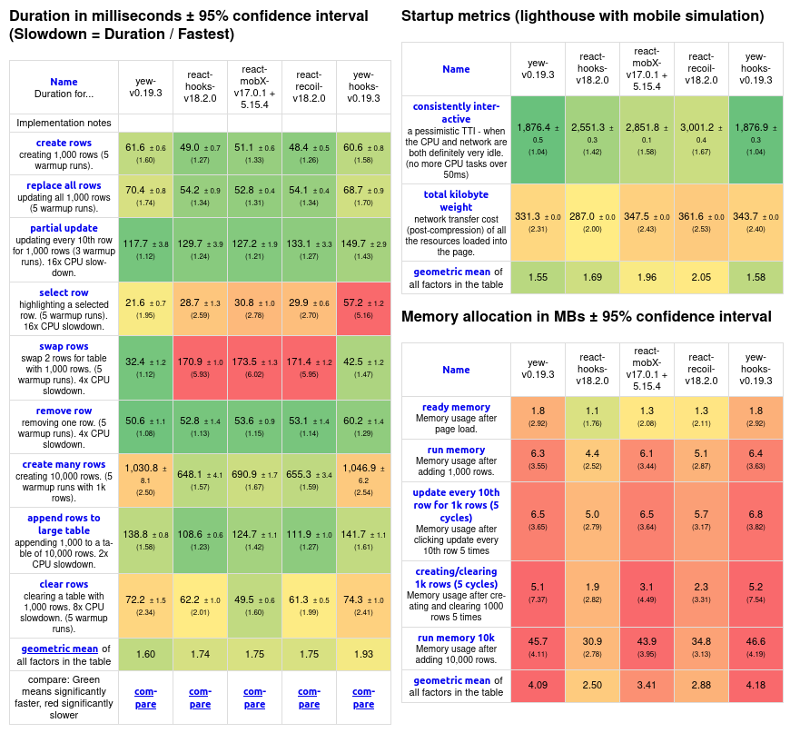

# <!--fit--> PV281: Programování v Rustu

---

# Today lecture's content

1. Introduction to WebAssembly
2. WASM apps using Canvas
3. WASM apps using DOM
5. Yew
6. Demonstration 

---

# <!--fit--> Introduction to WebAssembly

---

# WebAssembly

It's a **binary instruction format** for a (virtual) stack-based state machine. Compilers (for languages such as C, C++ or Rust) can target this intermediate language.

The **instructions are then executed** by the web browser. WASM can run alongside existing JavaScript. WASM code runs in a sandboxed environment.

For more information, see [the WebAssembly specification](https://webassembly.github.io/spec/core/index.html).

---


<!-- _class: split -->

### WASM

<div class=left-column>

#### C code

```c
int factorial(int n) {
  if (n == 0)
    return 1;
  else
    return n * factorial(n-1);
}
```

</div>
<div class=right-column>

#### WASM text output

```wat
(func (param i64) (result i64)
  local.get 0
  i64.eqz
  if (result i64)
      i64.const 1
  else
      local.get 0
      local.get 0
      i64.const 1
      i64.sub
      call 0
      i64.mul
  end)

```

</div>

---

# WASM advantages

- **Speed**
(only executing instructions rather than interpreting them)

- **Smaller memory usage footprint\* than JS**

- **Parallelism**
(we can write multithreaded code in the browser)

- **Memory Safety & smaller overhead**
(when utilizing RAII and non-GC languages)

- **Debugging**

\*when using non-GC languages, also depends on the framework

---

# WASM disadvantages

- VM-based machines **have to bundle the VM** along with the app

- The resulting **WASM binary file can grow very large**
(which impacts network performance)

- Still **cannot do everything JS can**, reliance on JS code may be inevitable

- An **immature ecosystem**

- **Development time & cost**
(compilation, language strictness & ties to the previous point)

---

# Existing WASM apps

- [Figma](https://www.figma.com/)
- [AutoCAD Web](https://web.autocad.com/login)
- [Google Earth](https://earth.google.com/web)
- Some games and 3D visualizers

---

# Things you should know about

- [Rust WASM book](https://rustwasm.github.io/docs/book/): Understanding how the Rust code gets to the browser
- [WebGL](https://www.khronos.org/webgl/): 3D rendering in browser
- [wasmer](https://wasmer.io/) & [wasmtime](https://wasmtime.dev/): WASM runtimes
(like `Node` or `Deno` for JS/TS projects)
- [trunk](https://trunkrs.dev/): Rust-generated WASM packager for browsers 
- [wasm-pack](https://rustwasm.github.io/wasm-pack/): Package Rust-generated WASM to run with JS code 
- [equi](https://github.com/emilk/egui): Uses WebGL & WASM to render in browser

---

# <!--fit--> WASM apps using Canvas

---

### Advantages of canvas-based apps

- Complete **control over the look and feel** of components

- **Smooth user experience** (when done right)

- Absolute **control over responsiveness**

- Smaller **app size**

- Unlimited **control over what is rendered** – allows easy development of 2D / 3D apps

---

### Disadvantages of canvas-based apps

- Often **implementation from scratch**

- When using a library, it's very **hard to modify elements**

- **Small ecosystem**

- **Difficult debugging**

---

# <!--fit--> WASM Apps using DOM
# (HTML and CSS)

---

### Advantages of DOM-based apps

- Used and **tested model of UI design**

- Complete **rewrite of a JS-based project is relatively straight forward**

- **Easy debugging**

- **Vast ecosystem** of libraries and solutions
- (most involve JS, joining WASM with JS is possible)

---

### Disadvantages of using DOM-based apps

- **Potentially slower** than canvas-based apps

- The **bundle size is larger** (need to ship HTML & CSS & WASM code)

- **Limited options with the design** – 2D / 3D apps and games are way harder to implement

---

# <!--fit--> Yew

---

# Yew

**Component-based Rust framework** utilizing DOM, based on the principles of ELM (a purely functional programming language).

Utilizes **virtual DOM** architecture.

Better performance and less CPU intense than JS-based solutions. Slightly higher RAM usage.

**Documentation is currently somewhat disappointing**, but is slowly improving over the years.

---

# Performance



---

# ELM principles

- Functional paradigm
- State machines
- `ui = fn(state)`
- Pure functions, less mistakes

---

# ELM principles

<br>

<div>

@startuml
!include https://raw.githubusercontent.com/plantuml-stdlib/C4-PlantUML/master/C4_Container.puml
!include https://raw.githubusercontent.com/plantuml-stdlib/C4-PlantUML/master/C4_Component.puml

Component(store, "Store", "Holds app state")
Component(view, "View", "Renders the UI of the component")
Component(update, "Update", "Sends message with the event")
Component(reducer, "Reducer", "State automata, returns new state")

Rel_L(store, view, "render")
Rel_L(view, update, "(event) message passing")
Rel_L(update, reducer, "processes")
Rel(reducer, store, "changes")

@enduml

</div>

---

# Before we start

We need to add the WASM compilation target for Rust:

```sh
rustup target add wasm32-unknown-unknown
```

---

# Before we start

We need to install [trunk](https://trunkrs.dev/),
a tool for building, bundling and deploying WASM apps:

```sh
cargo install trunk
```

---

# Before we start
### The reality of the framework

- It's **a beta framework**
(current version: `0.19`, bleeding edge version: `next`)

- **Libraries** are pretty much **non-existent**

- **Breaking changes** happen between versions

- **Non-existent tutorials** for complex solutions, only examples

- **Documentation** of advanced features **is sometimes lacking**

---

# Before we start

Some of the following slides use the `next` version of Yew,
some the `0.19` version,
and some target both.

This will always be denoted somewhere on the slide.

---

<!-- _class: split -->

### Dependencies

<div class=common-note>

Note: a lot of required functionality is added by other dependencies, such as `wasm-bindgen`, `gloo` or others.

</div>

<div class=left-column>

#### v. `0.19`

```toml
[dependencies]
yew = "0.19"
```

</div>
<div class=right-column>

#### v. `next`

```toml
[dependencies]
yew = { 
    git = "https://github.com/yewstack/yew/",
    features = ["csr"]
}

# Note the expanded `{ ... }` syntax has to be one line,
# as per TOML specification. Alternatively, you can use:

[dependencies.yew]
git = "https://github.com/yewstack/yew/"
features = ["csr"]
```

</div>

---

# `html!` macro

```rust
use yew::html;

html! {
    <div>
        <div data-key="abc"></div>
        <div class="parent">
            <span class="child"></span>
            <textarea value="write a story" />
        </div>
    </div>
}
```

---

# `html!` macro – advanced

```rust
use yew::html;

let show_link = false;

html! {
  <div>
    {
      if show_link {
        html! {
          <a href="https://example.com">{"Link"}</a>
        }
      } else {
        html! {}
      }
    }
  </div>
}
```

---

# Fragments

```rust
use yew::html;

html! {
    <>
        <div></div>
        <p></p>
    </>
}
```

---

# Components (v. `0.19`)

Components are Rust structs, resembling React's class-based components.
Every component has to implement the `Component` trait:

```rust
// these imports are used also on the following slides
use yew::{Component, Context, html, Html, Properties};

pub struct AmazingYewComponent;

impl Component for AmazingYewComponent {
    // ... implementation goes here
}
```

---


## Messages and Properties (v. `0.19`)

The component can have messages (events) that can happen within the component.

```rust
enum Msg {
    DoSomething,
}

#[derive(PartialEq, Properties)]
struct Props {
    some_property: String, // String is used just as the demo
}

impl Component for AmazingYewComponent {
    type Message = Msg;
    type Properties = Props;
    // the rest of the implementation ↓
}
```

---


## Messages and Properties (v. `0.19`)

Some components don't have props / events.
Missing types are set to Rust's Unit type – `()`.

```rust
// imports ↑

enum HomePageMsg {
    DoSomething,
}

impl Component for HomePage {
    type Message = HomePageMsg;
    // there are no properties for this component
    type Properties = ();
    // the rest of the implementation ↓
}
```

---


# `create` method (v. `0.19`)

Every component has a create method. The element also has a context, which has the element's props and `Scope`.

```rust
// imports and message / prop definitions ↑

impl Component for HomePage {
    // message / prop types are here

    fn create(ctx: &Context<Self>) -> Self {
        HomePage // or you can use "Self" here as well
    }
}
```

---


# `view` method (v. `0.19`)

Every component has a view method. View takes the element's context (scope and properties) and renders everything to HTML.

```rust
// imports and message / prop definitions ↑

impl Component for AmazingYewComponent {
    // message / prop types & the create method are here

    fn view(&self, ctx: &Context<Self>) -> Html {
        html! {
            <p> { &ctx.props().some_property } </p>
        }
    }
}
```

---

# `update` method (v. `0.19`)

First, we have a component with an inner state:

```rust
// imports ↑

enum ComponentWithStateMsg {
    SetShowText(bool),
}

pub struct ComponentWithState {
    show_text: bool;
}

impl Component for ComponentWithState {
    type Message = ComponentWithStateMsg;
    type Properties = ();

    fn create(ctx: &Context<Self>) -> Self {
        Self {
            show_text: false;
        }
    }

    // Continued on the next slide...
}
```

---

# `update` method (v. `0.19`)

We define the update method...

```rust
impl Component for ComponentWithState {
    // ...continued from the previous slide.

    fn update(&mut self, ctx: &Context <Self>, msg: Self::Message) -> bool {
        match msg {
            ComponentWithStateMsg::SetShowText(is_set) => {
                if self.show_text != is_set {
                    self.show_text = is_set;
                    true // trigger re-rendering
                } else {
                    false // nothing should change
                }
            }
        }
    }
    // Continued on the next slide...
}
```

---

# `update` method (v. `0.19`)

...so that we can render the component based on a condition.

```rust
impl Component for ComponentWithState {
    // ...continued from the previous slide.

    fn view(&self, ctx: &Context <Self>) -> Html {
        let onclick = ctx.link().callback(|_| ComponentWithStateMsg::SetShowText(!self.show_text));

        if (show_text) {
            html! {
                <>
                    <button {onclick}> { "Hide text" } </button>
                    <p> { "Never gonna give you up" } </p>
                </>
            }
        } else {
            html! {
                <button {onclick}> { "Show text" } </button>
            }
        }
    }
}
```

---

### Optional component methods (v. `0.19`)

- `rendered`: Perform side effects after the component is rendered.
- `changed`: Whether the component needs to be re-rendered after its props change. Defaults to true.
- `destroy`: On component unmount, there might be a need to clean up after the component.

By default, only the `create` and `view` method have to be implemented.

---

### Function components (v. `next`)

Check [the docs](https://yew.rs/docs/next/concepts/function-components) for more in-depth explanation on Yew components in the `next` version.

```rust
use yew::{function_component, html, Html};

#[function_component]
fn HelloFI() -> Html {
    html! { <p> { "42 is a nice number" } </p> }
}

// to use it, we can call the component name within the html! macro
#[function_component]
fn App() -> Html {
    html! { <HelloFI /> }
}
```

---

### Function components (v. `next`)

Function components can utilize [pre-defined hooks](https://yew.rs/docs/concepts/function-components/pre-defined-hooks) and also [custom hooks](https://yew.rs/docs/concepts/function-components/custom-hooks). Usage is very similar to React hooks.

```rust
use yew::{function_component, html, Html, use_state};

#[function_component]
fn HelloFI() -> Html {
    let counter = use_state(|| 42);
    let onclick = {
        let counter = counter.clone();
        Callback::from(move |_| counter.set(*counter + 1))
    }

    html! { <button {onclick}> { format!("{} is a nice number!", *counter) } </button> }
}
```

---

# Callbacks (both versions)

Allow communication within the component, as well as with agents, services and parent components.

This is one of the ways to handle interaction between components.

---

<!-- _class: split -->

### Callbacks

<div class=common-note>

Note: Both versions also implement `emit` method that allows you to call them within the business logic.

</div>

<div class=left-column>

#### v. `0.19`

```rust
let onclick = ctx
    .link().callback(move |_| {
//  ^^^^^^^^^^^^^^^^^^^ creating callback
    Msg::Clicked
});

html! {
    <button {onclick}>{ "Click" }</button>
    //      ^^^^^^^^ called on DOM event
}
```

</div>
<div class=right-column>

#### v. `next`

```rust
let onclick: Callback<_, Msg> = 
    Callback::from(move |_| {
//  ^^^^^^^^^^^^^^ creating callback
        Msg::Clicked
    });

html! {
    <button {onclick}> { "Emit me" } </button>
//          ^^^^^^^^^ called on DOM event
}
```

</div>

---

# Important HTML events

- `onclick`
- `onchange`
- `onkeypress`
- `onblur`
- `ondrag`, `ondragstart`, `ondragover`, `ondragleave`, `ondrop`, ...

---

# Using the component (v `0.19`)

```rust
use yew::{html, props, Children};
// container component is defined in a different file

// create properties with props! macro
let props = props!(Container::Properties {
    id: "container-2",
    children: Children::default(),
});

html! {
    <Container with props> // instead of manually passing props use "with" syntax
        // props.children will be overwritten with this
        <span>{ "I am a child, as you can see" }</span>
    </Container>
}
```

---

# Using the component (v. `next`)

First, let's define the function component `HelloWorld`.

```rust
use yew::{Properties, function_component, Html, html};

#[derive(Properties, PartialEq)]
pub struct Props {
    pub is_loading: bool,
}

#[function_component]
fn HelloWorld(props: &Props) -> Html {
    if props.is_loading {
        html! { "Loading" }
    } else {
        html! { "Hello world" }
    }
}
```

---

# Using the component (v. `next`)

Then, use the component somewhere else. Also shows how `properties!` macro can create properties.

```rust
// We use the HelloWorld component from the last slide.
#[function_component]
fn App() -> Html {
    let hello_world_props = props! { // We can create props with props! macro.
        HelloWorld::Properties{ is_loading: true }
    };

    html! {
        <HelloWorld ..hello_world_props>
            <p> { "Hello, I am a child of this component." } </p>
        </HelloWorld>
    }
}
```

---

# `key` and `ref` attributes

`key` works similarly to keys in React.
It helps Yew **determine which elements need to be re-rendered** by uniquely describing the element, e.g. when rendering lists of elements / components. 

`ref` is **used to manipulate the DOM element directly**.
This is useful if we want to embed JS library to our WASM project and modify the DOM element from JS and WASM.

--- 

<!-- _class: split -->

### App initialization

<div class=left-column>

#### v. `0.19`

```rust
use yew::prelude::*;

// incomplete function components (v0.19)
#[function_component(App)]
fn app() -> Html {
    html! {
        <h1>{ "Hello World" }</h1>
    }
}

fn main() {
    yew::start_app::<App>();
}
```

</div>
<div class=right-column>

#### v. `next`

```rust
use yew::prelude::*;

#[function_component(App)]
fn app() -> Html {
    html! {
        <h1>{ "Hello World" }</h1>
    }
}

fn main() {
    yew::Renderer::<App>::new().render();
    //   ^^^^^^^^         ^^^^^^^^^^^^^^
    // This API has changed.
}
```

</div>

---

### Component communication (v. `next`)

- **Props**: `parent → child` – data passed from parent to child, data change causes re-render by default.

- **Callbacks**: `child → parent` – passing a callback from parent to children allows them to message the parent.

- **Context**: `provider → subscribers` – passing data from a provider to subscribers dependent on data. Used with `use_context` hook.

- **Agents**: `parent ←→ child` for global store and complex scenarios (we'll talk about them later).

---

### Agents: shared state & global store

This allows for **parallel communication between components**, no matter how deep they are in the component hierarchy.

Agents are based on the _actor pattern_, and they run in their own web workers.

See [the docs](https://yew.rs/docs/next/concepts/agents) or [an example project](https://github.com/yewstack/yew/tree/master/examples/web_worker_fib) for more information.

---

# Which Yew version to choose?

For a somewhat more predictable behavior, use the `0.19` version. You may find more tutorials for the `0.19` version.

For a more "modern" API (using hooks), use the `next` version. The function components implementation is expanded. **Generally prefer the `next` version.**

**Both versions have their quirks and bugs, as the framework is not stable yet. Be cautious.**

---

# Using browser APIs

When we want to use data fetching, the console, or local storage,
we have two main `crate` options for working with the browser APIs:

- [wasm-bindgen](https://github.com/rustwasm/wasm-bindgen): Used to **interact with JS code**.
- [gloo](https://github.com/rustwasm/gloo): collection of libraries that provide idiomatic **wrappers for browser APIs**.

Prefer using [`gloo`](https://github.com/rustwasm/gloo) whenever you can.

---


# More advanced concepts

- [App routing](https://yew.rs/docs/next/concepts/router) (leveraging browser's History API)
- [Fetching data](https://yew.rs/docs/next/tutorial#fetching-data-using-external-rest-api) from external REST APIs
- Advanced ways to [deal with children components](https://yew.rs/docs/next/advanced-topics/children)
- Using [generic components](https://yew.rs/docs/next/concepts/function-components/generics) with Rust generics
- Using [suspense](https://yew.rs/docs/next/concepts/suspense): Displaying something while waiting for data
- Using [server side rendering](https://yew.rs/docs/next/advanced-topics/server-side-rendering) (also discussed to an extent in the last lecture)

---

# Demonstration time!

We will see how this goes!

The task is:
Create an app that uses function components with **props**, **iterates through a list of items**, and **uses state** for **some kind of interactivity**.

We will briefly [follow this tutorial](https://yew.rs/docs/next/tutorial).

---

# <!--fit--> Any questions?

---

# <!--fit--> Thank you for your attention!
